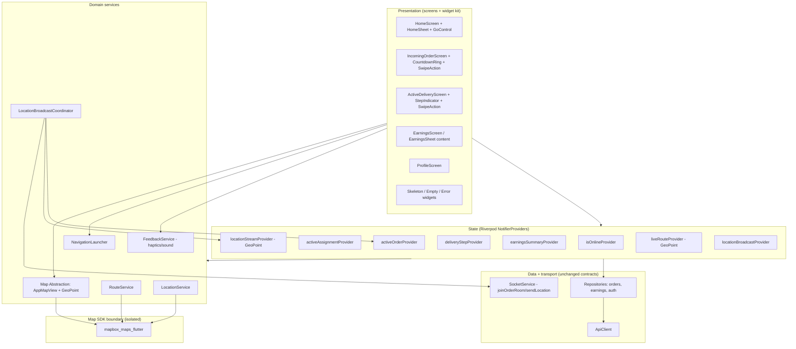
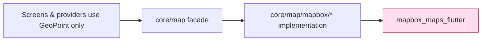

# Design Document

## Overview

This design redesigns the UI/UX of the existing Flutter rider app (`apps/rider_app`) for the four core flows (home/shift, incoming order, active delivery, earnings), wires the realtime rider GPS broadcast, and introduces a map abstraction layer. It deliberately reuses the current architecture — Flutter, Riverpod `NotifierProvider`s, `go_router`, and the Socket.IO `SocketService` — and changes neither the backend, the API/socket contracts, nor the brand/theme tokens.

The work is organized around three pillars:

1. **A reusable interaction component kit** — a draggable home sheet, an animated GO control, a swipe-to-confirm control, an animated countdown ring, a horizontal step indicator, and a brand-consistent skeleton/empty/error vocabulary. These standardize the redesigned screens while staying inside the existing teal palette and light/dark theme.
2. **Realtime + device integration** — wiring `SocketService.joinOrderRoom`/`sendLocation` to the live location stream so the rider broadcasts position during an active delivery, plus external-navigation handoff, real `tel:` dialing, the chat entry, and haptic/sound feedback.
3. **A map abstraction layer** — an SDK-neutral `GeoPoint` coordinate type and a thin map facade so screens never import `mapbox_maps_flutter`. This contains the planned (out-of-scope) Mapbox→Google Maps migration to a single layer.

### Key findings from the existing code that shape this design

- **State already exists** for the core flows: `isOnlineProvider` (in `home_screen.dart`), `activeAssignmentProvider`, `activeOrderProvider`, `deliveryStepProvider`, and `orderDetailProvider` (in `order_providers.dart`). The realtime streams `incomingAssignmentStreamProvider`, `assignmentExpiredStreamProvider`, and `orderStatusStreamProvider` are wired in `socket_service.dart`.
- **`SocketService` already exposes `joinOrderRoom(orderId)` and `sendLocation(...)`** (emitting `order:join` and `rider:location`). They are simply never called today — Requirement 6 is a wiring task, not a contract change.
- **`AppMapView`, `MapboxDirectionsService`, `route_provider.dart`, and `location_provider.dart` all import `mapbox_maps_flutter` and traffic in the Mapbox `Position` type**, and the two screens (`incoming_order_screen.dart`, `active_delivery_screen.dart`) import Mapbox directly. The abstraction layer must absorb these imports.
- **Theme tokens are centralized** in `AppColors` (teal `primary = #008060`, `online`, `busy`, `offline`, light/dark surfaces) and `AppTheme`. The redesign consumes these tokens only; it adds none.
- **The customer app already has `AppShimmerEffect`** (`apps/customer_app/lib/core/widgets/shimmers/app_shimmer_effect.dart`) built on the `shimmer` package. The rider app does not depend on `shimmer` yet. We mirror that shimmer language with a rider-local `AppShimmerEffect` to keep apps decoupled while visually consistent.
- **The earnings repository currently swallows errors and returns `null`**, which cannot satisfy the "Error_State with failure reason + retry" requirement. The repository is refactored to surface a typed failure (app-internal change; the endpoint itself is unchanged).

### New dependencies introduced

| Package | Purpose | Requirements |
| --- | --- | --- |
| `shimmer` | Skeleton loaders matching the customer app shimmer language | 1.5, 9.1, 9.5 |
| `url_launcher` | `tel:` dialing and external navigation handoff (geo/Google Maps/Waze) | 4.4, 5.2 |
| `audioplayers` | Alert sound on incoming assignment | 7.1 |

Vibration and haptics use the built-in `flutter/services` `HapticFeedback` API (no extra dependency). The Mapbox SDK and access-token bootstrap in `main.dart` remain, but token configuration moves behind the map abstraction's implementation layer.

## Architecture

### Layered structure



### Map SDK containment

Today `mapbox_maps_flutter` is imported by `app_map_view.dart`, `mapbox_directions_service.dart`, `route_provider.dart`, `location_provider.dart`, `incoming_order_screen.dart`, `active_delivery_screen.dart`, and `main.dart`. After this design, Mapbox imports are confined to the map abstraction's implementation files only:



Screens and feature providers depend on `GeoPoint` and `List<GeoPoint>`. The implementation layer (`core/map/mapbox/…`) performs `GeoPoint ↔ Position` conversion and is the only place allowed to `import 'package:mapbox_maps_flutter/...'`. A migration to Google Maps would replace only `core/map/mapbox/…` (and its registration), leaving every screen untouched.

### Navigation

`go_router` routes are unchanged in shape; one route is added for the profile view (`/profile`). Screen transitions:

- `HomeScreen` → (assignment arrives & no active assignment/order) → `IncomingOrderScreen` (`context.push`)
- `IncomingOrderScreen` → (accept) → `ActiveDeliveryScreen` (`pushReplacement`); (reject/expire) → back to `HomeScreen`
- `ActiveDeliveryScreen` → (delivery complete) → `HomeScreen` (`context.go`)
- `HomeScreen` header `ProfileEntry` → `ProfileScreen` (`push`); logout-confirm → `LoginScreen` (`go`)

## Components and Interfaces

### 1. Map Abstraction Layer (`core/map/`)

The cornerstone of Requirement 10. Screens and providers exchange only SDK-neutral types.

**`GeoPoint`** — immutable SDK-neutral coordinate.

```dart
@immutable
class GeoPoint {
  final double latitude;
  final double longitude;
  const GeoPoint({required this.latitude, required this.longitude});

  @override
  bool operator ==(Object other) =>
      other is GeoPoint &&
      other.latitude == latitude &&
      other.longitude == longitude;

  @override
  int get hashCode => Object.hash(latitude, longitude);
}
```

**`MapMarker`** — a marker the abstraction can render (carries the SDK-neutral point plus presentation intent, including heading for the directional rider marker, Requirement 6.6).

```dart
enum MapMarkerKind { rider, pickup, dropoff, generic }

@immutable
class MapMarker {
  final GeoPoint point;
  final MapMarkerKind kind;
  final double? headingDegrees; // used by the rider marker
  const MapMarker({required this.point, this.kind = MapMarkerKind.generic, this.headingDegrees});
}
```

**`AppMapView` (refactored facade)** — same widget name and location (`core/widgets/map/app_map_view.dart`) but its public API is SDK-neutral:

```dart
class AppMapView extends StatefulWidget {
  final GeoPoint? initialCamera;
  final List<GeoPoint>? route;
  final List<MapMarker>? markers;
  const AppMapView({super.key, this.initialCamera, this.route, this.markers});
}
```

Internally it delegates to a private Mapbox implementation widget under `core/map/mapbox/` that converts `GeoPoint → Position` and draws polylines/markers exactly as the current implementation does. The Mapbox access-token bootstrap (currently in `main.dart`) moves into `core/map/mapbox/mapbox_bootstrap.dart` and is invoked from `main()`; this keeps `main.dart` free of the Mapbox import.

**`RouteService`** — abstraction over directions (replaces direct use of `MapboxDirectionsService` from providers).

```dart
abstract class RouteService {
  /// Returns route points between two coordinates as SDK-neutral points.
  Future<List<GeoPoint>> getRoute(GeoPoint start, GeoPoint end);
}
```

`MapboxRouteService` implements it by wrapping the existing `MapboxDirectionsService` and mapping `Position` results to `GeoPoint` (Requirement 10.6).

**`LocationService`** — abstraction over geolocation, emitting `GeoPoint`.

```dart
abstract class LocationService {
  Stream<GeoPoint> positionStream();   // live positions
  Future<GeoPoint?> currentPosition();
}
```

`GeolocatorLocationService` wraps the existing geolocator logic from `location_provider.dart`, returning `GeoPoint` and keeping the Dhaka fallback behavior. `locationStreamProvider` (renamed conceptually from `currentLocationStreamProvider`) exposes `GeoPoint`.

**Conversion helpers** live only inside `core/map/mapbox/` (Requirement 10.5):

```dart
extension GeoPointMapbox on GeoPoint {
  Position toPosition() => Position(longitude, latitude);
}
extension PositionGeoPoint on Position {
  GeoPoint toGeoPoint() => GeoPoint(latitude: lat.toDouble(), longitude: lng.toDouble());
}
```

> Note Mapbox `Position(lng, lat)` ordering — the conversion encapsulates this footgun so screens never deal with axis order.

The existing `liveRouteProvider`/`RouteRequest`/`LiveRouteNotifier` are migrated to `GeoPoint` and `RouteService`, removing their Mapbox imports.

### 2. Home Sheet + GO Control (`features/shift/presentation/`)

**`HomeScreen`** keeps its `Stack` of map + overlay, but the static bottom pill and `Switch` are replaced by a persistent `HomeSheet`.

**`HomeSheet`** — a `DraggableScrollableSheet` (persistent, non-dismissible) layered over `AppMapView` (Requirement 1.1). Snap positions: collapsed (`minChildSize`) and expanded (`maxChildSize`); dragging animates between them (1.8).

- **Collapsed content** (1.2): `GoControl`, today's total earnings, today's trip count.
- **Expanded content** (1.3): earnings breakdown, acceptance rate, hours online, and recent deliveries list.
- **Loading** (1.5): earnings values are replaced by `AppShimmerEffect` skeletons.
- **Error** (1.6, 1.7): an inline `ErrorStateView` with a retry control that re-requests `earningsSummaryProvider`.
- Data source: `earningsSummaryProvider` → `EarningsSummary` (1.4).

```dart
class HomeSheet extends ConsumerWidget {
  const HomeSheet({super.key});
  // builds DraggableScrollableSheet; watches earningsSummaryProvider;
  // renders GoControl + collapsed stats; expands to breakdown/recent deliveries.
}
```

**`GoControl`** — the animated availability centerpiece (Requirement 2).

```dart
class GoControl extends ConsumerStatefulWidget {
  const GoControl({super.key});
}
```

Behavior:
- Tap → `RiderOnlineController.toggle()` which `PATCH`es `/users/rider/online` with the new status **before** updating `isOnlineProvider` (2.2, 2.3).
- While in flight → shows a loading indicator and ignores taps (2.4).
- On failure → keeps previous status, shows error (2.5).
- Online → online color treatment + pulse-and-glow animation (`AnimationController` repeat) over the map (2.6).
- Offline → dimmed treatment; the host screen dims the map (2.7).
- false→true transition → one-shot color-sweep animation (2.8).

The toggle logic moves from `_HomeScreenState._toggleStatus` into a small `RiderOnlineController` (a `Notifier` or method on a dedicated provider) so the GO control is reusable and testable, but the network sequencing (request-before-state) is preserved.

### 3. Incoming Order Screen (`features/orders/presentation/screens/incoming_order_screen.dart`)

Redesigned to earnings-first with an animated ring and swipe-to-accept (Requirement 3).

- **Trigger** (3.1): unchanged — `HomeScreen` listens to `incomingAssignmentStreamProvider` and pushes this screen only when `activeAssignmentProvider` and `activeOrderProvider` are both null.
- **Payout prominence** (3.2): estimated payout rendered as the largest, highest-contrast value.
- **Two-leg trip summary** (3.3): a `TripLegSummary` widget showing the restaurant pickup leg and customer dropoff leg, each with its own distance.
- **Countdown ring** (3.4, 3.5): `CountdownRing` wraps the primary action; animates full→empty over the response window derived from `expiresAt`; switches to the warning color when `remaining ≤ 10s`.
- **Accept** (3.6): a `SwipeAction` (slide-to-confirm) calls `acceptAssignment`, fetches the order, sets `activeOrderProvider`, resets `deliveryStepProvider` to 0, joins the order room (Req 6.1), and `pushReplacement`s to the active delivery screen.
- **Reject** (3.7, 3.8): a distinct secondary control calls `rejectAssignment` and returns home.
- **Expiry** (3.9): the countdown timer clears `activeAssignmentProvider` and pops home.
- **Accept failure** (3.10): shows an error and re-enables the accept `SwipeAction`.
- Map locations and route are passed as `GeoPoint`/`List<GeoPoint>` only (10.2).

**`CountdownRing`** — `CustomPainter`-based circular progress around a child.

```dart
class CountdownRing extends StatelessWidget {
  final double fraction;     // 1.0 = full, 0.0 = empty (clamped)
  final bool isWarning;      // remaining <= warningThreshold
  final Widget child;
  const CountdownRing({super.key, required this.fraction, required this.isWarning, required this.child});
}
```

The view-state derivation (fraction + warning flag from remaining/total seconds) is a pure function `CountdownState.from(remaining, total)` so it can be property-tested independently of animation.

### 4. Active Delivery Screen (`features/orders/presentation/screens/active_delivery_screen.dart`)

Redesigned with a horizontal step indicator, external navigation, swipe-to-confirm, and real contact actions (Requirements 4, 5).

- **Step indicator** (4.1, 4.2): `StepIndicator` renders stages Restaurant → Pickup → Customer → Delivered, highlighting the stage for the current `deliveryStepProvider` value via a pure `DeliveryStage.forStep(step)` mapping.
- **Navigate action** (4.3, 4.4, 4.5): `NavigateAction` opens the current destination `GeoPoint` in an external app via `NavigationLauncher`; if none is available it shows a "no navigation app found" message.
- **Confirm swipe** (4.6, 4.7, 4.8): `SwipeAction` drives the delivery state machine through `DeliveryProgressController`:
  - step 0 → `PICKED_UP`, advance to 1
  - step 1 → `ON_THE_WAY`, advance to 2
  - step 2 → present proof-of-delivery flow
- **Proof of delivery** (4.9): the existing `_ProofOfDeliverySheet` is retained; a valid PIN completes the order, clears `activeOrderProvider`/`activeAssignmentProvider`/`deliveryStepProvider`, and returns home.
- **Status-update failure** (4.10): shows an error and retains the current `deliveryStepProvider` value.
- **Call control** (5.1, 5.2, 5.5, 5.6): shown only when the order carries a customer phone; launches `tel:` via `NavigationLauncher`; hidden when no phone; shows an error if the dialer cannot launch.
- **Chat entry** (5.3, 5.4): a message control distinct from call that opens the defined chat entry for the active order (a `ChatScreen` route/sheet keyed by order id; this redesign defines the entry point and a minimal placeholder chat surface, since backend chat contracts are out of scope).
- **Rider marker** (6.6): the map shows a directional rider `MapMarker` (kind `rider`, `headingDegrees` from the latest position) reflecting the live position/heading.
- Map locations/route passed as `GeoPoint` only (10.3).

**`DeliveryProgressController`** — encapsulates the step→status state machine.

```dart
class DeliveryProgressController {
  /// Pure mapping used by both the controller and tests.
  static String? statusForStep(int step); // 0->PICKED_UP, 1->ON_THE_WAY, 2->null (POD)
  Future<void> confirmCurrentStep();       // calls repo; on success advances step; on failure retains step
}
```

### 5. Reusable `SwipeAction` (`core/widgets/swipe_action.dart`)

Slide-to-confirm control used by both accept (Req 3) and confirm (Req 4), themed with the active palette (Req 11.4).

```dart
class SwipeAction extends StatefulWidget {
  final String label;
  final IconData icon;
  final bool enabled;
  final Future<void> Function() onConfirmed; // fires only when the handle crosses the threshold
  const SwipeAction({super.key, required this.label, required this.icon, required this.onConfirmed, this.enabled = true});
}
```

On a completed swipe it triggers haptic feedback via `FeedbackService` (Req 7.2, 7.3) and invokes `onConfirmed`; if `onConfirmed` throws, the handle springs back to re-enable the action (supports 3.10/4.10).

### 6. Feedback, Navigation, and Broadcast services (`core/services/`)

**`FeedbackService`** (Requirement 7):

```dart
class FeedbackService {
  Future<void> onIncomingAssignment(); // vibrate + play alert sound (7.1); vibration always fires so muted devices still buzz (7.4)
  Future<void> onConfirm();            // haptic feedback (7.2, 7.3)
}
```

Haptics use `HapticFeedback`; sound uses `audioplayers`. All calls are wrapped so that a missing capability never interrupts the action (7.5). Incoming-assignment feedback is triggered from the same `ref.listen(incomingAssignmentStreamProvider)` site that pushes the incoming screen.

**`NavigationLauncher`** (Requirements 4.4, 4.5, 5.2, 5.6):

```dart
class NavigationLauncher {
  Future<bool> openExternalNavigation(GeoPoint destination); // tries geo:/Google Maps/Waze; false if none
  Future<bool> dial(String phoneNumber);                     // launches tel: URI; false on failure
}
```

URI builders (`buildTelUri`, `buildGeoUri`) are pure functions, tested independently.

**`LocationBroadcastCoordinator`** (Requirement 6) — the GPS broadcast wiring.

```dart
final locationBroadcastProvider = Provider<void>((ref) {
  // Watches activeOrderProvider + locationStreamProvider; emits broadcasts.
});
```

Behavior, expressed as a pure decision so it is testable:

```dart
class LocationBroadcast {
  final String orderId;
  final double latitude, longitude;
  final double? heading;
}

/// Returns a broadcast iff an active order exists. Pure; no socket I/O.
LocationBroadcast? decideBroadcast(String? activeOrderId, GeoPoint? position, double? heading);
```

The coordinator:
- On accept, calls `SocketService.joinOrderRoom(orderId)` (6.1).
- For each new `GeoPoint`, if an active order exists, builds a `LocationBroadcast` (orderId, lat, lng, heading) and calls `sendLocation` — **regardless of whether the join has completed** (6.2, 6.3).
- If `SocketService` is disconnected when a position arrives, it calls `connect()` (reconnect) before the next broadcast (6.7).
- When the active order is cleared/completed, it stops broadcasting (6.4); when no active order exists, it never broadcasts (6.5).

### 7. Profile entry + confirmed logout (`features/auth/` / `features/profile/`)

- **`ProfileEntry`** (8.1, 8.2): an avatar control in the home header; tapping pushes `ProfileScreen`.
- **`ProfileScreen`** (8.3): shows rider identity and a logout control.
- **Confirmed logout** (8.4–8.7): logout shows a confirmation dialog. Confirm → on success log out and `go` to login; on failure retain session, show error, stay (existing `AuthNotifier.logout` is extended to surface failure). Dismiss → retain session, stay.

The current header `logOut` icon that calls `_logout` directly is replaced by `ProfileEntry`; the destructive logout now lives behind confirmation inside the profile view.

### 8. Skeleton, Empty, and Error vocabulary (`core/widgets/feedback/`)

Mirrors the customer app's shimmer language for cross-app consistency (Requirement 9).

- **`AppShimmerEffect`** — rider-local port of the customer app widget (`shimmer` package), themed from `AppColors` for light/dark (9.1, 9.5).
- **`EmptyStateView`** — icon + message for successful-but-empty data sets (9.2).
- **`ErrorStateView`** — failure reason + retry control; retry re-requests the data (9.3, 9.4).

These are used by the Home Sheet earnings, the earnings screen history, and any first-load remote data.

## Data Models

All models are app-side view/parse models. They map the existing endpoint/socket payloads (`Map<String, dynamic>`) into typed objects; no backend contract changes. Parsing is tolerant — missing optional fields degrade to `null`/`'--'` rather than throwing.

### EarningsSummary (Requirement 1, 9)

```dart
class EarningsSummary {
  final num todayTotal;          // totalEarnings
  final int tripCount;           // totalTrips
  final double? acceptanceRate;  // optional; null -> render '--'
  final String hoursOnline;      // onlineHours (e.g. "3h 20m")
  final List<EarningsEntry> recentDeliveries; // history

  factory EarningsSummary.fromJson(Map<String, dynamic> json);
}

class EarningsEntry {
  final num amount;
  final String type;
  final String time;
  factory EarningsEntry.fromJson(Map<String, dynamic> json);
}
```

Backed by `earningsSummaryProvider` (a `FutureProvider`/`AsyncNotifier`) that calls the refactored `EarningsRepository.getEarningsSummary()` which now throws a typed `EarningsFailure` on error instead of returning `null`.

### AssignmentView (Requirement 3)

Parses the `assignment:created` payload / `activeAssignmentProvider` map.

```dart
class AssignmentView {
  final String assignmentId;
  final String? orderId;
  final num? estimatedPayout;       // estimatedPayout / deliveryFee fallback
  final num? cashToCollect;         // grandTotal / cashToCollect fallback
  final String paymentMethod;
  final String pickupName;
  final num? pickupLat, pickupLng;
  final num? dropoffLat, dropoffLng;
  final num? pickupLegKm;           // restaurant leg distance
  final num? dropoffLegKm;          // customer leg distance
  final DateTime? expiresAt;        // drives the countdown

  GeoPoint? get pickupPoint;        // SDK-neutral
  GeoPoint? get dropoffPoint;
}
```

### ActiveOrderView (Requirements 4, 5, 6)

Parses `activeOrderProvider`.

```dart
class ActiveOrderView {
  final String id;
  final String customerName;
  final String? customerPhone;      // drives call control visibility
  final String deliveryAddress;
  final String restaurantName;
  final GeoPoint? restaurantPoint;
  final GeoPoint? dropoffPoint;
  final String paymentMethod;
  final num? grandTotal;
  final int? etaMinutes;

  bool get hasPhone => (customerPhone ?? '').isNotEmpty;
  GeoPoint? destinationForStep(int step); // step<2 -> restaurant, else dropoff
}
```

### Delivery state model (Requirement 4)

```dart
enum DeliveryStage { restaurant, pickup, customer, delivered }

class DeliveryStateModel {
  static DeliveryStage stageForStep(int step);      // 0->restaurant,1->pickup,2->customer
  static String? statusForStep(int step);           // 0->PICKED_UP,1->ON_THE_WAY,2->null
  static int? nextStep(int step);                    // 0->1,1->2,2->null (POD)
}
```

### Countdown + Map broadcast value models

```dart
class CountdownState {
  final double fraction;  // clamp(remaining/total, 0, 1)
  final bool isWarning;   // remaining <= 10
  factory CountdownState.from(int remainingSeconds, int totalSeconds);
}
```

`GeoPoint`, `MapMarker`, `LocationBroadcast` are defined above in the abstraction/services sections.

### Theme tokens (Requirement 11)

No new tokens. All components consume `AppColors`/`AppTheme` and `Theme.of(context).brightness`. The GO control online/offline/warning treatments map to `AppColors.online`, dimmed `primary`, and `AppColors.busy`/`offline`; the countdown warning uses `AppColors.offline`/`busy`.

## Correctness Properties

*A property is a characteristic or behavior that should hold true across all valid executions of a system — essentially, a formal statement about what the system should do. Properties serve as the bridge between human-readable specifications and machine-verifiable correctness guarantees.*

Much of this feature is UI rendering, theming, animation, and side-effect wiring, which are validated by widget/example tests rather than property-based tests (see Testing Strategy). The properties below target the pure-logic core that genuinely varies with input: data parsing, the rider-online toggle sequencing, countdown derivation, the delivery step state machine, URI builders, the location-broadcast decision, and the map coordinate conversions.

### Property 1: Earnings summary parsing maps fields

*For any* well-formed earnings payload (with optional fields present or absent), `EarningsSummary.fromJson` produces a summary whose today-total, trip count, hours-online, and recent-deliveries reflect the payload, and missing optional fields degrade to a null/placeholder rather than throwing.

**Validates: Requirements 1.4**

### Property 2: Rider-online toggle requests before mutating state

*For any* target online status, activating the GO control issues the rider-online request **before** `isOnlineProvider` is updated.

**Validates: Requirements 2.2**

### Property 3: Successful toggle sets status to the target

*For any* target online status, when the rider-online request succeeds, `isOnlineProvider` ends equal to that target status.

**Validates: Requirements 2.3**

### Property 4: In-flight toggle ignores re-entrant activations

*For any* number N ≥ 1 of GO-control activations occurring while a single rider-online request is in flight, exactly one rider-online request is issued.

**Validates: Requirements 2.4**

### Property 5: Failed toggle retains the previous status

*For any* starting online status, when the rider-online request fails, `isOnlineProvider` is unchanged from its starting value and an error is surfaced.

**Validates: Requirements 2.5**

### Property 6: Incoming screen shown only when idle

*For any* combination of `activeAssignmentProvider` and `activeOrderProvider` values when an assignment arrives, the Incoming_Order_Screen is presented if and only if both are null.

**Validates: Requirements 3.1**

### Property 7: Countdown derivation is correct and monotonic

*For any* total window `T > 0` and remaining seconds `r` in `[0, T]`, `CountdownState.from(r, T)` yields `fraction == clamp(r / T, 0, 1)` (so the ring runs full→empty monotonically as `r` decreases) and `isWarning == (r <= 10)`.

**Validates: Requirements 3.4, 3.5**

### Property 8: Delivery step state machine is well-defined

*For any* delivery step in `{0, 1, 2}`, the state model maps the step to the correct stage highlight, the correct target status (`0 → PICKED_UP`, `1 → ON_THE_WAY`), and the correct next step (`0 → 1`, `1 → 2`), while step `2` yields no status update and instead routes to the proof-of-delivery flow.

**Validates: Requirements 4.2, 4.6, 4.7, 4.8**

### Property 9: Failed status update retains the delivery step

*For any* delivery step in `{0, 1}`, when the order-status update request fails, `deliveryStepProvider` is unchanged and an error is surfaced.

**Validates: Requirements 4.10**

### Property 10: External-navigation URI encodes the destination

*For any* destination `GeoPoint`, `buildGeoUri` produces a navigation URI whose coordinates equal that point's latitude and longitude.

**Validates: Requirements 4.4**

### Property 11: Call-control visibility tracks phone presence

*For any* active order, the call control is shown if and only if the order's customer phone number is non-empty.

**Validates: Requirements 5.1, 5.5**

### Property 12: Dialer URI encodes the phone number

*For any* phone-number string, `buildTelUri` produces a `tel:` URI that encodes that phone number.

**Validates: Requirements 5.2**

### Property 13: Location-broadcast decision

*For any* position, heading, and active-order state, `decideBroadcast` returns a broadcast if and only if an active order exists; when it does, the broadcast carries that order's id and the position's latitude, longitude, and heading; the decision is independent of whether the order-room join has completed.

**Validates: Requirements 6.2, 6.3, 6.4, 6.5**

### Property 14: GeoPoint ↔ SDK coordinate round-trip

*For any* `GeoPoint`, converting it to the underlying SDK coordinate type and back yields an equal `GeoPoint` (within floating-point tolerance); equivalently, conversion preserves latitude and longitude across the abstraction boundary.

**Validates: Requirements 10.5**

### Property 15: Route conversion returns SDK-neutral points

*For any* list of underlying SDK route points, the `RouteService` result is the element-wise `GeoPoint` conversion of that list — same length, with each output point's latitude/longitude matching the corresponding source point.

**Validates: Requirements 10.6**

## Error Handling

The redesign standardizes how failures surface, using the shared feedback vocabulary and preserving safe state on every failure path.

### Network / request failures

- **Earnings load (1.6, 9.3):** `EarningsRepository.getEarningsSummary()` is refactored to throw a typed `EarningsFailure(message)` instead of returning `null`. `earningsSummaryProvider` exposes the error via `AsyncValue.error`; the Home Sheet and earnings screen render `ErrorStateView` with the failure reason and a retry that re-requests the provider (1.7, 9.4).
- **Rider-online toggle (2.5):** failure keeps the previous `isOnlineProvider` value (no optimistic flip) and shows a snackbar; the request-before-state ordering (2.2) guarantees state is only mutated after a confirmed success.
- **Accept assignment (3.10):** failure shows an error and the accept `SwipeAction` springs its handle back to re-enable it; `activeOrderProvider`/`deliveryStepProvider` are not mutated.
- **Reject assignment (3.8):** failures are logged but still clear the assignment and return home, matching current behavior (reject is best-effort).
- **Order-status update (4.10):** failure shows an error and leaves `deliveryStepProvider` at its current value, so the rider can retry the same step.
- **Logout (8.6):** failure retains the session and tokens, shows an error, and stays on the current screen; only a confirmed, successful logout clears state and navigates to login.

### Device / capability failures

- **External navigation (4.5):** if no nav app handles the geo/Google Maps/Waze URI (`NavigationLauncher.openExternalNavigation` returns false), show "no navigation app found".
- **Dialer (5.6):** if `tel:` cannot launch (`dial` returns false), show "the call could not be started".
- **Haptics/sound (7.4, 7.5):** all `FeedbackService` calls are wrapped so a missing or failing capability never throws into the action path; vibration is attempted independently of sound so a muted device still buzzes on a new assignment.

### Realtime / socket failures

- **Disconnected socket (6.7):** when a GPS position arrives and `SocketService.isConnected` is false, the broadcast coordinator calls `connect()` (reconnect) before the next broadcast; broadcasts are attempted regardless of join completion (6.2).
- **No active order (6.4, 6.5):** the broadcast coordinator emits nothing — the pure `decideBroadcast` returns null — so a stale stream cannot leak location after completion.

### Parsing / missing data

- All view models (`EarningsSummary`, `AssignmentView`, `ActiveOrderView`) parse tolerantly: required ids are validated, optional fields degrade to null/`'--'`. A missing `assignmentId` disables accept; a missing destination hides the route/marker rather than crashing the map.

### Map SDK boundary

- Coordinate conversions live only in the implementation layer; an invalid coordinate is clamped/validated at the `GeoPoint` boundary so screens never pass malformed values into the SDK.

## Testing Strategy

This feature mixes a small, high-value pure-logic core with a large amount of UI, theming, animation, and platform-integration surface. We use a dual approach: **property-based tests** for the pure logic and **widget/unit/integration (example) tests** for everything else. The map-abstraction architectural constraints (Req 10.1–10.4) are verified by **static import/smoke checks**.

### Tooling

- **Property-based testing:** the `fast_check`-style approach for Dart via the `glados` package (idiomatic Dart PBT). We do not hand-roll generators or a PBT engine.
- **Widget/unit/integration:** `flutter_test` with `ProviderScope` overrides; mock repositories/services (e.g., `mocktail`) for `OrdersRepository`, `EarningsRepository`, `SocketService`, `NavigationLauncher`, and `FeedbackService`.
- **Static checks:** a repo-walking test (and/or `dart analyze` custom check) that greps for `mapbox_maps_flutter` imports outside `core/map/mapbox/`.

### Property-based tests (pure logic)

Each correctness property is implemented by a **single** property-based test, configured to run a **minimum of 100 iterations**, and tagged with a comment referencing the design property:

`// Feature: rider-app-ui-redesign, Property {n}: {property text}`

| Property | Unit under test |
| --- | --- |
| P1 | `EarningsSummary.fromJson` over generated payloads |
| P2–P5 | `RiderOnlineController.toggle` with an ordering/counting mock client |
| P6 | incoming-screen guard predicate over `(assignment, order)` presence |
| P7 | `CountdownState.from(remaining, total)` |
| P8 | `DeliveryStateModel` (`stageForStep`/`statusForStep`/`nextStep`) over steps |
| P9 | `DeliveryProgressController.confirmCurrentStep` failure path |
| P10 | `buildGeoUri(GeoPoint)` |
| P11 | call-control visibility from `ActiveOrderView.hasPhone` |
| P12 | `buildTelUri(phone)` |
| P13 | `decideBroadcast(activeOrderId, position, heading)` |
| P14 | `GeoPoint.toPosition().toGeoPoint()` round-trip |
| P15 | `MapboxRouteService` mapping of SDK points → `List<GeoPoint>` (SDK directions mocked) |

Generators cover edge cases called out in the requirements: empty/whitespace phone strings, missing optional earnings fields, `remaining` at/over/under the 10s threshold and at the `0` and `T` boundaries, all delivery steps including the POD branch, and coordinate extremes (poles/antimeridian, negative lat/lng) for the conversion round-trip.

### Widget / example tests

These cover the UI, interaction, theming, and side-effect criteria classified as EXAMPLE in prework:

- **Home Sheet:** persistent/draggable over the map (1.1), collapsed vs expanded content (1.2, 1.3), loading skeletons (1.5), inline error + retry (1.6), drag animation (1.8).
- **GO control:** placement (2.1), online/offline visual treatment + pulse (2.6, 2.7), color-sweep on false→true (2.8).
- **Incoming order:** payout prominence (3.2), two-leg summary (3.3), accept swipe → accept + navigate (3.6), distinct reject (3.7, 3.8), expiry → clear + home (3.9), accept-failure re-enable (3.10).
- **Active delivery:** four-stage indicator (4.1, 4.3), no-nav-app message (4.5), POD sheet presentation (4.8 UI), valid-PIN completion (4.9), chat entry distinct from call (5.3, 5.4), no-dialer message (5.6), rider marker passed to map (6.6).
- **Realtime wiring:** join on accept (6.1), reconnect on disconnected position (6.7).
- **Feedback:** vibrate+sound on assignment (7.1), haptics on confirm/accept (7.2, 7.3), vibrate when muted (7.4), graceful no-op when unavailable (7.5).
- **Profile/logout:** profile entry + avatar (8.1, 8.2), logout control (8.3), confirmation prompt (8.4), confirmed success → login (8.5), failure retains session (8.6), dismiss retains session (8.7).
- **Feedback vocabulary:** first-load skeletons (9.1), empty state (9.2), error state + retry (9.3, 9.4), light/dark palette (9.5).
- **Theming:** teal palette across screens (11.1), light/dark tokens (11.2, 11.3), new components themed (11.4).

### Static / smoke tests (map abstraction)

- **10.1–10.3:** assert `AppMapView` and the map/route/location services expose only `GeoPoint`/`List<GeoPoint>`/`MapMarker` in their public APIs, and that the incoming and active screens reference `GeoPoint` (no Mapbox types).
- **10.4:** a repo-wide test that fails if any file outside `core/map/mapbox/` imports `mapbox_maps_flutter`.

### Balance

Property tests carry the burden of input coverage for the logic core; widget tests focus on representative scenarios, integration points (provider→repository→navigation), and the error/edge branches rather than exhaustively enumerating inputs. Together they give comprehensive coverage without redundant unit tests.
