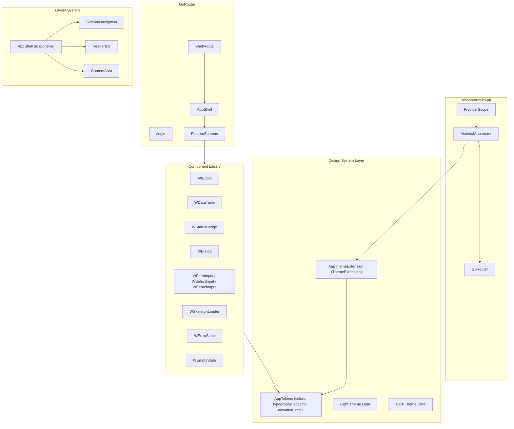
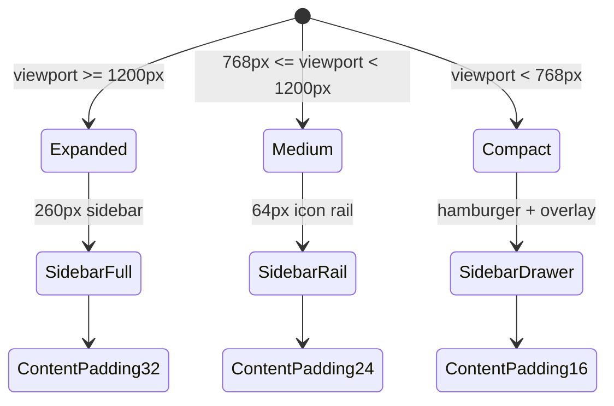
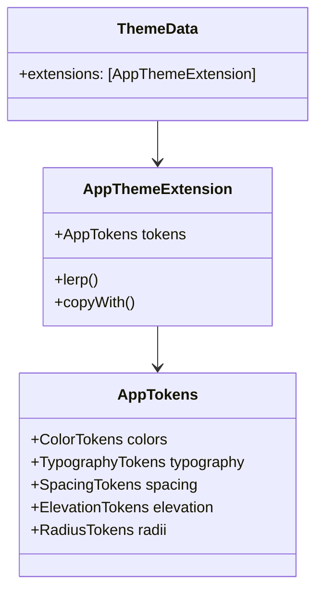
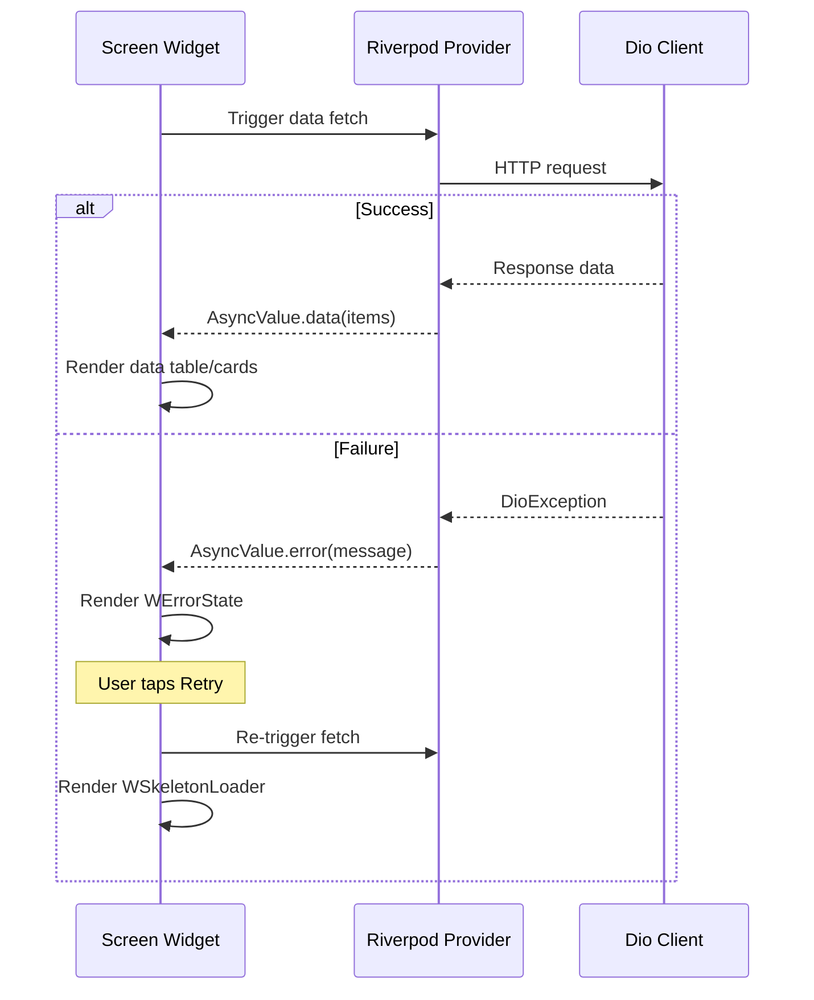

# Design Document: Admin Panel Redesign

## Overview

This design defines the technical architecture for a comprehensive UI/UX redesign of the Wasabi Admin Panel — a Flutter web application for food delivery management. The redesign introduces a centralized design token system, a reusable component library, responsive layout, dark mode support, and polished screen implementations while preserving the existing business logic, Riverpod state management, GoRouter routing, and Dio-based networking layers.

The approach is purely presentational: we replace scattered hardcoded values and inconsistent widgets with a token-driven, composable component system. The existing `ShellRoute` pattern remains the structural backbone; we consolidate the two competing sidebar implementations into a single responsive navigation component and apply consistent loading/error/empty states across all feature screens.

### Key Design Decisions

| Decision | Rationale |
|----------|-----------|
| Single `AppTokens` class for all design tokens | Eliminates magic numbers, enables dark mode via token swapping |
| Composition over inheritance for components | Buttons, badges, inputs compose tokens rather than extending Material widgets directly |
| Responsive breakpoints via `LayoutBuilder` | Avoids MediaQuery overhead in deeply nested widgets |
| Consolidate sidebar into `AppShell` pattern | Removes duplication, enables responsive rail/drawer modes |
| `shimmer` package for skeleton screens | Lightweight, well-maintained, avoids custom animation code |
| Retain `data_table_2` but wrap in custom widget | Preserves existing pagination logic while adding consistent styling |
| Theme extension for dark mode tokens | Flutter's `ThemeExtension` mechanism for custom token access |

---

## Architecture

### High-Level Structure



### Layer Responsibilities

| Layer | Responsibility | Location |
|-------|---------------|----------|
| Design System | Token definitions, theme data, theme extension | `lib/core/theme/` |
| Component Library | Reusable UI widgets consuming tokens | `lib/core/widgets/` |
| Layout | Responsive shell, sidebar, header | `lib/core/widgets/layouts/` |
| Features | Screen-level composition of components | `lib/features/{feature}/presentation/` |

### Responsive Architecture



### Theme Architecture



---

## Components and Interfaces

### 1. Design Token Classes

#### `ColorTokens`

```dart
class ColorTokens {
  // Neutral gray scale (50-900)
  final Color gray50, gray100, gray200, gray300, gray400,
              gray500, gray600, gray700, gray800, gray900;

  // Primary accent
  final Color primary, primaryLight, primaryDark;

  // Semantic
  final Color success, successLight, warning, warningLight,
              error, errorLight, info, infoLight;

  // Surface / Background / Border
  final Color surface, background, border, borderStrong;

  // Text
  final Color textPrimary, textSecondary, textDisabled, onPrimary;

  const ColorTokens({...});
}
```

#### `TypographyTokens`

```dart
class TypographyTokens {
  // Named sizes
  static const double xs = 11, sm = 12, base = 13, md = 14,
                       lg = 16, xl = 18, xxl = 20, xxxl = 24;

  // Named weights
  static const FontWeight regular = FontWeight.w400;
  static const FontWeight medium = FontWeight.w500;
  static const FontWeight semibold = FontWeight.w600;
  static const FontWeight bold = FontWeight.w700;

  // Font family
  static const String fontFamily = 'Plus Jakarta Sans';

  // Convenience TextStyle builders
  TextStyle style({double size = base, FontWeight weight = regular, Color? color});
}
```

#### `SpacingTokens`

```dart
class SpacingTokens {
  static const double xs = 4, sm = 8, md = 12, lg = 16,
                       xl = 20, xxl = 24, xxxl = 32,
                       xxxxl = 40, xxxxxl = 48;
}
```

#### `ElevationTokens`

```dart
class ElevationTokens {
  static const List<BoxShadow> none = [];
  static const List<BoxShadow> sm = [BoxShadow(color: Color(0x0A000000), blurRadius: 4, offset: Offset(0, 1))];
  static const List<BoxShadow> md = [BoxShadow(color: Color(0x0D000000), blurRadius: 8, offset: Offset(0, 2))];
  static const List<BoxShadow> lg = [BoxShadow(color: Color(0x12000000), blurRadius: 16, offset: Offset(0, 4))];
}
```

#### `RadiusTokens`

```dart
class RadiusTokens {
  static const double none = 0, sm = 4, md = 6, lg = 8, xl = 12, xxl = 16;

  static BorderRadius get borderRadiusSm => BorderRadius.circular(sm);
  static BorderRadius get borderRadiusMd => BorderRadius.circular(md);
  static BorderRadius get borderRadiusLg => BorderRadius.circular(lg);
  static BorderRadius get borderRadiusXl => BorderRadius.circular(xl);
  static BorderRadius get borderRadiusXxl => BorderRadius.circular(xxl);
}
```

---

### 2. WButton Component

```dart
enum WButtonVariant { primary, secondary, ghost, destructive }
enum WButtonSize { sm, md, lg }

class WButton extends StatelessWidget {
  final String label;
  final VoidCallback? onPressed;
  final WButtonVariant variant;
  final WButtonSize size;
  final bool isLoading;
  final bool isDisabled;
  final IconData? leadingIcon;

  // Size mappings:
  // sm: height 32, hPadding 12, text sm, icon 16
  // md: height 36, hPadding 16, text base, icon 18
  // lg: height 40, hPadding 20, text md, icon 20
}
```

**Behavior:**
- Disabled: opacity 0.5, ignores taps
- Loading: 16px spinner replaces label, maintains dimensions, ignores taps
- Icon gap: 8px between leading icon and label

---

### 3. WDataTable Component

```dart
class WDataTable<T> extends StatelessWidget {
  final List<WTableColumn<T>> columns;
  final List<T> data;
  final bool isLoading;
  final bool hasError;
  final String? errorMessage;
  final VoidCallback? onRetry;
  final int currentPage;
  final int totalItems;
  final int pageSize; // 10, 25, 50
  final ValueChanged<int>? onPageChanged;
  final ValueChanged<int>? onPageSizeChanged;
  final int? sortColumnIndex;
  final bool sortAscending;
  final ValueChanged<int>? onSort;
  final Widget Function(T item)? onRowTap;
}

class WTableColumn<T> {
  final String label;
  final Widget Function(T item) cellBuilder;
  final bool sortable;
  final double? width;
}
```

**States:**
- Loading → 5 shimmer rows matching column structure
- Error → `WErrorState` with retry callback
- Empty → `WEmptyState` with entity-specific messaging
- Data → alternating gray50/white rows, 64px row height, hover gray100

---

### 4. WStatusBadge Component

```dart
enum StatusBadgeVariant { success, warning, error, info, neutral }

class WStatusBadge extends StatelessWidget {
  final String label; // max 20 chars, displayed uppercase
  final StatusBadgeVariant variant;

  // Renders: tinted bg (10% alpha), semantic text color,
  // font xs, weight w600, radius sm, hPadding 8, vPadding 4
}

// Predefined mappings
class OrderStatusMapping {
  static StatusBadgeVariant fromStatus(String status) => switch(status) {
    'PENDING' => StatusBadgeVariant.warning,
    'PREPARING' => StatusBadgeVariant.info,
    'ON_THE_WAY' => StatusBadgeVariant.info,
    'DELIVERED' => StatusBadgeVariant.success,
    'CANCELLED' => StatusBadgeVariant.error,
    _ => StatusBadgeVariant.neutral,
  };
}

class RiderStatusMapping {
  static StatusBadgeVariant fromStatus(String status) => switch(status) {
    'APPROVED' => StatusBadgeVariant.success,
    'PENDING' => StatusBadgeVariant.warning,
    'REJECTED' => StatusBadgeVariant.error,
    'SUSPENDED' => StatusBadgeVariant.error,
    _ => StatusBadgeVariant.neutral,
  };
}
```

---

### 5. WDialog Component

```dart
class WDialog extends StatelessWidget {
  final String title;
  final String? subtitle;
  final Widget content;
  final List<Widget> actions; // Right-aligned, 12px gap
  final VoidCallback? onClose;

  // maxWidth: 560px, radius: xl, padding: 24px
  // Fade-in 200ms, fade-out 150ms
  // Backdrop: black 40% alpha
  // Scrollable content if overflow, fixed header/footer
}
```

---

### 6. Form Input Components

```dart
class WTextInput extends StatelessWidget {
  final String? label; // text sm, w500, 4px bottom margin
  final String? placeholder;
  final String? errorText; // error color, text xs, max 2 lines, 4px top
  final TextEditingController? controller;
  final bool disabled; // opacity 0.5, gray50 fill, no interaction
  final ValueChanged<String>? onChanged;

  // height: 36px, radius: md, border: 1px border token
  // focus: 2px primary border, hPadding: 12px
}

class WSelectInput extends StatelessWidget {
  final String? label;
  final List<SelectOption> options;
  final SelectOption? value;
  final String? errorText;
  final bool disabled;
  final ValueChanged<SelectOption>? onChanged;

  // Matches TextInput styling, max 6 visible dropdown items
}

class WSearchInput extends StatelessWidget {
  final String? placeholder;
  final ValueChanged<String>? onChanged; // 300ms debounce
  final bool disabled;

  // Leading search icon 20px, same height/styling as TextInput
}
```

---

### 7. Layout Components

#### `AppShell` (Consolidated Sidebar + Header + Content)

```dart
class AppShell extends ConsumerWidget {
  final Widget child;

  // Responsive behavior:
  // >= 1200px: full sidebar (260px) + header + content (padding 32px)
  // 768-1199px: icon rail (64px) + header + content (padding 24px)
  // < 768px: no sidebar + header with hamburger + content (padding 16px)
  //          hamburger opens drawer overlay
}
```

#### `SidebarNavigation`

```dart
class SidebarNavigation extends ConsumerWidget {
  final String currentPath;
  final bool isCollapsed; // rail mode
  final VoidCallback? onLogout;

  // Sections: Main, Management, Marketing, People, Assets
  // Active state: 3px left border (primary), 8% primary bg, primary icon+text w600
  // Hover: gray100 bg, 150ms transition
  // Bottom: user profile (36px avatar, name, role, logout)
  // Icons: SVG, 20px consistent
}
```

#### `HeaderBar`

```dart
class HeaderBar extends ConsumerWidget {
  final GlobalKey<ScaffoldState>? scaffoldKey; // for hamburger on compact

  // Fixed height: 56px, bottom border 1px
  // Search: 36px height, radius md, 300ms debounce, max 8 results dropdown
  // Notification bell: 20px, badge for unread (capped 99+)
  // User avatar: 32px circle, initials fallback
  // Breadcrumb: max 4 levels, clickable ancestors, "/" divider
  // Theme toggle: sun/moon icon in profile section
}
```

---

### 8. State Components

```dart
class WSkeletonLoader extends StatelessWidget {
  final SkeletonVariant variant; // table, kpiCards, chart, generic

  // Shimmer animation cycling every 1.5s
  // Table: 5 rows of horizontal bars
  // KPI: rectangular blocks matching card dimensions
  // Chart: single rectangular block
}

class WErrorState extends StatelessWidget {
  final String? message; // max 150 chars, ellipsis truncation
  final VoidCallback? onRetry;

  // Icon: 24px, error color
  // Title: "Something went wrong"
  // Retry button: secondary variant
}

class WEmptyState extends StatelessWidget {
  final String title; // e.g. "No orders found"
  final String? subtitle;
  final IconData? icon; // 48px
  final String? actionLabel;
  final VoidCallback? onAction;
}
```

---

### 9. Route Transitions

```dart
// Applied in GoRouter page builder
CustomTransitionPage fadeTransition({
  required Widget child,
  Duration duration = const Duration(milliseconds: 200),
  Curve curve = Curves.easeInOut,
}) {
  return CustomTransitionPage(
    child: child,
    transitionsBuilder: (context, animation, secondaryAnimation, child) {
      return FadeTransition(opacity: animation, child: child);
    },
    transitionDuration: duration,
  );
}

// Login route uses 300ms duration
// All ShellRoute children use 200ms duration
// No slide, scale, rotation, or bounce animations
```

---

## Data Models

### Theme State

```dart
// Riverpod provider for theme mode persistence
@riverpod
class ThemeMode extends _$ThemeMode {
  @override
  ThemeMode build() => _loadFromStorage() ?? ThemeMode.light;

  void toggle() {
    state = state == ThemeMode.light ? ThemeMode.dark : ThemeMode.light;
    _persistToStorage(state);
  }

  ThemeMode? _loadFromStorage() { /* SharedPreferences */ }
  void _persistToStorage(ThemeMode mode) { /* SharedPreferences */ }
}
```

### Status Mappings

```dart
// Enum for order statuses used across the app
enum OrderStatus { pending, preparing, onTheWay, delivered, cancelled }

extension OrderStatusX on OrderStatus {
  String get displayLabel => switch (this) {
    OrderStatus.pending => 'PENDING',
    OrderStatus.preparing => 'PREPARING',
    OrderStatus.onTheWay => 'ON THE WAY',
    OrderStatus.delivered => 'DELIVERED',
    OrderStatus.cancelled => 'CANCELLED',
  };

  StatusBadgeVariant get badgeVariant => switch (this) {
    OrderStatus.pending => StatusBadgeVariant.warning,
    OrderStatus.preparing => StatusBadgeVariant.info,
    OrderStatus.onTheWay => StatusBadgeVariant.info,
    OrderStatus.delivered => StatusBadgeVariant.success,
    OrderStatus.cancelled => StatusBadgeVariant.error,
  };
}

enum RiderApprovalStatus { approved, pending, rejected, suspended }

extension RiderApprovalStatusX on RiderApprovalStatus {
  StatusBadgeVariant get badgeVariant => switch (this) {
    RiderApprovalStatus.approved => StatusBadgeVariant.success,
    RiderApprovalStatus.pending => StatusBadgeVariant.warning,
    RiderApprovalStatus.rejected => StatusBadgeVariant.error,
    RiderApprovalStatus.suspended => StatusBadgeVariant.error,
  };
}
```

### Responsive Breakpoints

```dart
class Breakpoints {
  static const double compact = 768;
  static const double medium = 1200;

  static LayoutMode fromWidth(double width) {
    if (width < compact) return LayoutMode.compact;
    if (width < medium) return LayoutMode.medium;
    return LayoutMode.expanded;
  }
}

enum LayoutMode { compact, medium, expanded }
```

### Navigation Model

```dart
class NavSection {
  final String label;
  final List<NavItem> items;
}

class NavItem {
  final String title;
  final String route;
  final String svgIcon; // SVG string for flutter_svg
}

// Predefined sections
final navSections = [
  NavSection(label: 'Main', items: [NavItem(title: 'Dashboard', route: '/dashboard', svgIcon: dashboardSvg)]),
  NavSection(label: 'Management', items: [
    NavItem(title: 'Orders', route: '/orders', svgIcon: ordersSvg),
    NavItem(title: 'Menu', route: '/menu', svgIcon: menuSvg),
    NavItem(title: 'Add-ons', route: '/addons', svgIcon: addonsSvg),
  ]),
  NavSection(label: 'Marketing', items: [
    NavItem(title: 'Banners', route: '/banners', svgIcon: bannersSvg),
    NavItem(title: 'Coupons', route: '/coupons', svgIcon: couponsSvg),
  ]),
  NavSection(label: 'People', items: [
    NavItem(title: 'Customers', route: '/customers', svgIcon: customersSvg),
    NavItem(title: 'Riders', route: '/riders', svgIcon: ridersSvg),
  ]),
  NavSection(label: 'Assets', items: [NavItem(title: 'Media', route: '/media', svgIcon: mediaSvg)]),
];
```


---

## Correctness Properties

*A property is a characteristic or behavior that should hold true across all valid executions of a system — essentially, a formal statement about what the system should do. Properties serve as the bridge between human-readable specifications and machine-verifiable correctness guarantees.*

### Property 1: Spacing tokens are multiples of the base unit

*For any* spacing token value in the `SpacingTokens` class, the value SHALL be a positive multiple of the 4px base unit.

**Validates: Requirements 1.3**

### Property 2: Elevation shadow alpha constraint

*For any* elevation token in the `ElevationTokens` class (excluding `none`), all `BoxShadow` color alpha values SHALL be less than 0.08.

**Validates: Requirements 1.4**

### Property 3: Button size specification consistency

*For any* `WButtonSize` variant (sm, md, lg), the rendered button height, horizontal padding, text size, and icon size SHALL match the defined size mapping (sm→32/12/12/16, md→36/16/13/18, lg→40/20/14/20).

**Validates: Requirements 2.4**

### Property 4: Sort column toggle is an involution

*For any* sortable column in a `WDataTable`, tapping the column header twice SHALL return the sort state to its original direction (ascending→descending→ascending).

**Validates: Requirements 3.7**

### Property 5: Pagination navigation button state correctness

*For any* combination of `currentPage` (≥ 1) and `totalPages` (≥ 1), the previous button SHALL be disabled if and only if `currentPage == 1`, and the next button SHALL be disabled if and only if `currentPage == totalPages`.

**Validates: Requirements 3.9**

### Property 6: StatusBadge variant color mapping consistency

*For any* `StatusBadgeVariant` value, the badge background color SHALL equal the semantic color at 10% alpha, and the text color SHALL equal the full semantic color.

**Validates: Requirements 4.2**

### Property 7: StatusBadge label formatting

*For any* input label string, the displayed text SHALL be the uppercase transformation of the input. *For any* input string exceeding 20 characters, the displayed text SHALL be truncated to 20 characters with an ellipsis appended.

**Validates: Requirements 4.3**

### Property 8: Status string to variant mapping with fallback

*For any* status string passed to `OrderStatusMapping.fromStatus` or `RiderStatusMapping.fromStatus`, the function SHALL return the predefined variant for known statuses (PENDING→warning, PREPARING→info, ON_THE_WAY→info, DELIVERED→success, CANCELLED→error for orders; APPROVED→success, PENDING→warning, REJECTED→error, SUSPENDED→error for riders) and SHALL return `neutral` for any string not in the predefined set.

**Validates: Requirements 4.4, 4.5, 4.6**

### Property 9: Navigation item active state determination

*For any* navigation item with route `R` and any current path `P`, the item SHALL be in active state if and only if `P == R` or (`R != '/'` and `P.startsWith(R)`).

**Validates: Requirements 5.3**

### Property 10: Notification badge display logic

*For any* non-negative integer `count`, the notification badge SHALL: be hidden when `count == 0`, display the numeric string of `count` when `1 <= count <= 99`, and display "99+" when `count > 99`.

**Validates: Requirements 6.4**

### Property 11: Breadcrumb depth constraint

*For any* navigation path with `N` segments, the breadcrumb trail SHALL display at most 4 levels, showing the last `min(N, 4)` segments with all but the final segment being clickable.

**Validates: Requirements 6.7**

### Property 12: Responsive breakpoint resolution

*For any* viewport width `W` (positive number), the layout mode SHALL be `compact` when `W < 768`, `medium` when `768 <= W < 1200`, and `expanded` when `W >= 1200`.

**Validates: Requirements 16.1**

### Property 13: Email validation correctness

*For any* string input to the email validator, the validator SHALL accept the string if and only if it contains at least one `@` character followed by at least one `.` character (with at least one character between them and after the dot), and SHALL reject empty strings.

**Validates: Requirements 19.6**

---

## Error Handling

### Strategy

All error handling follows a layered approach:

| Layer | Responsibility | Mechanism |
|-------|---------------|-----------|
| Network (Dio) | Catch HTTP/network errors | Existing Dio interceptors (unchanged) |
| State (Riverpod) | Expose error state to UI | `AsyncValue.error` pattern |
| UI (Components) | Display user-friendly error | `WErrorState` component |

### Error Display Rules

1. **Never expose raw errors**: No stack traces, exception type names, or technical error strings shown to users (Requirement 15.6)
2. **Truncate messages**: Error descriptions capped at 150 characters with ellipsis
3. **Always offer retry**: Every `WErrorState` includes a retry button invoking the parent's data fetch callback
4. **Revert on failure**: Toggle/switch operations (e.g., availability toggle in menu) revert to previous state on API failure (Requirement 9.8)
5. **Preserve state on action failure**: Approve/reject operations preserve current status if the API call fails (Requirement 11.6)

### Error Flow



### Form Validation Errors

- Inline display below the respective field (4px top spacing)
- Error color text, font size xs, max 2 lines
- Prevent form submission until all required fields valid
- Clear field error when user modifies the field value

---

## Testing Strategy

### Testing Approach

This redesign is primarily a UI/presentation layer change. The testing strategy uses a dual approach:

1. **Property-based tests** — for pure logic functions (status mappings, breakpoint resolution, token constraints, validation logic)
2. **Widget tests** — for component rendering, interaction behavior, and state transitions
3. **Golden tests** — for visual regression of key components (optional, recommended for CI)

### Property-Based Testing

**Library**: `dart_quickcheck` (or `glados` for Dart PBT)
**Minimum iterations**: 100 per property

Each property test references its design document property:

```dart
// Feature: admin-panel-redesign, Property 8: Status string to variant mapping with fallback
test('any unknown status string maps to neutral', () {
  // Property-based test with 100+ random strings
});
```

**Properties to implement:**
| # | Property | Target Function |
|---|----------|----------------|
| 1 | Spacing multiples of 4 | `SpacingTokens` values |
| 2 | Elevation alpha < 0.08 | `ElevationTokens` shadow colors |
| 3 | Button size spec | `WButton` size resolution |
| 4 | Sort toggle involution | `WDataTable` sort state |
| 5 | Pagination button state | `WDataTable` pagination logic |
| 6 | Badge variant color | `WStatusBadge` color resolution |
| 7 | Label formatting | `WStatusBadge` label transform |
| 8 | Status mapping fallback | `OrderStatusMapping` / `RiderStatusMapping` |
| 9 | Nav active state | Route matching logic |
| 10 | Notification badge display | Badge count formatting |
| 11 | Breadcrumb depth | Breadcrumb path truncation |
| 12 | Breakpoint resolution | `Breakpoints.fromWidth` |
| 13 | Email validation | Email validator function |

### Widget Tests

**Framework**: `flutter_test` (built-in)

Key widget tests per component:
- `WButton`: all 4 variants render correctly, disabled/loading states, icon rendering
- `WDataTable`: loading skeleton, empty state, error state, row hover, pagination controls
- `WStatusBadge`: each variant renders correct colors, truncation behavior
- `WDialog`: open/close animations, backdrop dismiss, scrollable content
- `WTextInput` / `WSelectInput` / `WSearchInput`: focus states, error display, disabled state
- `SidebarNavigation`: section grouping, active item styling, responsive modes
- `HeaderBar`: search debounce, notification badge, breadcrumb rendering
- `AppShell`: responsive layout at each breakpoint

### Integration Tests

- Theme toggle persists and applies without reload
- Login form validation prevents submission with invalid data
- Order filter chips correctly filter table data
- Rider approve/reject workflow updates list
- Navigation between all routes applies fade transition

### Test File Organization

```
test/
├── core/
│   ├── theme/
│   │   ├── tokens_property_test.dart      (Properties 1, 2)
│   │   └── breakpoints_property_test.dart  (Property 12)
│   ├── widgets/
│   │   ├── w_button_test.dart             (Property 3 + widget tests)
│   │   ├── w_data_table_test.dart         (Properties 4, 5 + widget tests)
│   │   ├── w_status_badge_test.dart       (Properties 6, 7, 8 + widget tests)
│   │   ├── w_dialog_test.dart
│   │   ├── w_form_inputs_test.dart
│   │   ├── w_skeleton_loader_test.dart
│   │   ├── w_error_state_test.dart
│   │   └── w_empty_state_test.dart
│   └── navigation/
│       ├── sidebar_test.dart              (Property 9 + widget tests)
│       ├── header_test.dart               (Properties 10, 11 + widget tests)
│       └── app_shell_test.dart
├── features/
│   ├── auth/
│   │   └── login_validation_test.dart     (Property 13 + widget tests)
│   ├── dashboard/
│   │   └── dashboard_screen_test.dart
│   ├── orders/
│   │   └── orders_screen_test.dart
│   └── ...
└── integration/
    ├── theme_toggle_test.dart
    └── navigation_test.dart
```
