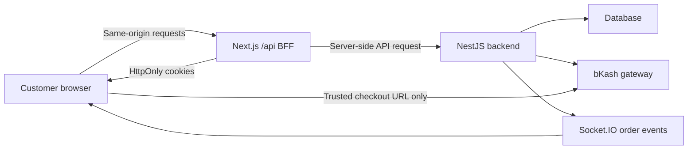

# Customer Web Completion Change Record

**Recorded:** 2026-08-07  
**Scope:** `customer-web`, its NestJS integration points, automated tests, and launch configuration  
**Primary audience:** project owner and future developers  
**Implementation status:** repository work complete; live provider and deployment verification still required

## 1. Purpose

The customer website is the temporary primary customer product while the Flutter customer app is held for a later audience-driven launch. The implementation was completed as a mobile-first web replacement, with the assumption that about 90% of visits will come from phones.

The work focused on four launch-critical outcomes:

1. Use live backend data instead of silently showing demo storefront data.
2. Make authentication and payment safe for a public browser application.
3. Complete the customer ordering journey from discovery to delivery tracking.
4. Provide responsive UI, automated browser coverage, and deployable production configuration.

## 2. Resulting architecture



The browser no longer needs direct access to backend access or refresh tokens. The Next.js backend-for-frontend (BFF) owns the session cookies and proxies only approved API paths.

## 3. Changes completed

### 3.1 Live storefront data

- Removed silent mock-storefront fallbacks from menu and landing-page queries.
- Connected restaurant information, menu items, featured items, categories, coupons, reviews, availability, and delivery quotes to backend data.
- Derived landing-page categories from the live menu.
- Replaced fake restaurant contact information, coordinates, hours, and delivery-distance claims with safe empty states when live data is unavailable.
- Added loading, error, empty, image fallback, and retry states so an API failure is visible instead of being disguised as valid demo data.

Key areas:

- `lib/api/queries/menu.ts`
- `lib/api/queries/coupons.ts`
- `lib/restaurant-info.ts`
- `components/landing/*`
- `components/menu/*`
- `app/page.tsx`
- `app/menu/page.tsx`

### 3.2 Mobile-first customer experience

- Completed responsive layouts for phone, tablet, and desktop widths.
- Added a five-destination mobile bottom navigation including Offers.
- Added sticky mobile cart and checkout actions for thumb-friendly ordering.
- Improved overflow handling, spacing, touch targets, form labels, and small-screen checkout layout.
- Added a responsive offers page with coupon code copy, minimum spend, and expiry information.
- Added responsive account, favorites, notifications, orders, support, privacy, terms, payment callback, and forgotten-password pages.

Key areas:

- `components/mobile-bottom-nav.tsx`
- `components/cart-bar.tsx`
- `app/checkout/page.tsx`
- `app/offers/page.tsx`
- `app/account/page.tsx`
- `app/orders/*`

### 3.3 Authentication and browser session security

- Added a same-origin Next.js BFF at `/api/backend/*`.
- Moved access and refresh tokens into `HttpOnly`, `SameSite=Lax` cookies; production cookies are also `Secure`.
- Removed JWT persistence from browser-accessible Zustand/local storage and added migration logic to scrub older stored tokens.
- Added automatic access-token refresh and refresh-token rotation after backend `401` responses.
- Added logout revocation and cookie clearing.
- Added mutation origin and fetch-site validation to reduce cross-site request abuse.
- Restricted proxy destinations to the configured backend and validated forwarded client IP values.
- Added a short-lived same-origin socket-token endpoint for authenticated realtime connections.
- Protected post-login redirects against open redirects.
- Restored sessions on page load using `/users/me`.
- Added Bangladesh phone normalization, password login, OTP login/registration, forgotten-password reset, and editable customer name.
- Changed unknown login/reset OTP requests to a generic success response to reduce account enumeration.

Key files:

- `lib/server/backend-proxy.ts`
- `app/api/backend/[...path]/route.ts`
- `app/api/auth/socket-token/route.ts`
- `store/auth-store.ts`
- `components/auth-bootstrap.tsx`
- `lib/auth/redirect.ts`
- `lib/auth/phone.ts`
- `lib/auth/profile.ts`
- `app/(auth)/login/page.tsx`
- `app/(auth)/forgot-password/page.tsx`
- `backend/src/modules/auth/auth.service.ts`
- `backend/src/modules/auth/auth.service.spec.ts`

### 3.4 Checkout correctness

- Replaced client-assumed totals with backend-aligned subtotal, tax, packaging, discount, delivery fee, and minimum-order calculations.
- Added delivery and pickup choices.
- Added saved-address and manual-location support.
- Added delivery quote checks before order placement.
- Invalidates or revalidates coupons when order context changes.
- Preserved separate COD and online-payment paths.
- Added clear validation and failure messages instead of allowing an apparently successful invalid checkout.

Key files:

- `lib/checkout-pricing.ts`
- `lib/api/queries/checkout.ts`
- `lib/api/queries/addresses.ts`
- `lib/api/queries/coupons.ts`
- `store/cart-store.ts`
- `app/checkout/page.tsx`

### 3.5 bKash online payment

- Added online payment types and query hooks.
- Added online order creation followed by bKash payment initiation.
- Allows redirects only to trusted HTTPS `bkash.com` and `bka.sh` hosts and their subdomains.
- Added an order-aware callback URL so payment execution can find the correct order.
- Added idempotent payment execution on the callback page.
- Added explicit success, cancelled, and failed callback states.
- Added payment retry from an order detail page when an online payment is still pending or failed.
- Kept kitchen visibility gated by the backend `PAID` state.
- Added backend validation that production callback URLs use HTTPS.

Key files:

- `lib/payments.ts`
- `lib/api/queries/payments.ts`
- `app/payment/callback/page.tsx`
- `app/orders/[id]/page.tsx`
- `backend/src/modules/payments/payments.service.ts`
- `backend/src/modules/payments/payments.service.spec.ts`
- `backend/.env.example`

### 3.6 Orders, delivery, and realtime tracking

- Completed order history and order detail flows.
- Added cancellation, reorder, review, complaint, and support actions.
- Added `PICKED_UP` support to customer-visible tracking.
- Added rider assignment expiry checks and realtime order event handling.
- Added internal-rider delivery-code handling.
- Kept external-delivery confirmation separate from internal rider delivery proof.
- Added socket room cleanup and safer authenticated realtime access.

Key files:

- `lib/api/queries/orders.ts`
- `lib/order-status.ts`
- `lib/realtime/socket.ts`
- `app/orders/page.tsx`
- `app/orders/[id]/page.tsx`
- `backend/src/gateways/realtime.gateway.ts`
- `backend/src/modules/dispatch/dispatch.service.ts`
- `backend/src/modules/dispatch/dispatch.service.spec.ts`
- `backend/src/modules/orders/orders.controller.ts`
- `backend/src/modules/orders/orders.service.ts`

### 3.7 Security headers and operational reliability

- Added Content Security Policy, clickjacking protection, MIME-sniffing protection, referrer policy, permissions policy, and production HSTS.
- Disabled the framework-powered response header.
- Added route-level, global, loading, and not-found states.
- Added `/api/health` for deployment health checks.
- Added optional analytics that stays disabled without an ID and respects browser Do Not Track.
- Added privacy policy and terms pages.

Key files:

- `next.config.ts`
- `app/api/health/route.ts`
- `app/error.tsx`
- `app/global-error.tsx`
- `app/loading.tsx`
- `app/not-found.tsx`
- `components/analytics.tsx`
- `app/privacy/page.tsx`
- `app/terms/page.tsx`

### 3.8 SEO and acquisition readiness

- Added page metadata, canonical site configuration, Open Graph, and Twitter card metadata.
- Added an installable web manifest and brand icon.
- Added `robots.txt` and `sitemap.xml` routes.
- Connected Offers in desktop navigation, mobile navigation, footer, sitemap, and robots configuration.

Key files:

- `app/layout.tsx`
- `app/manifest.ts`
- `app/robots.ts`
- `app/sitemap.ts`
- `public/icon.svg`
- `components/site-header.tsx`
- `components/landing/landing-nav.tsx`
- `components/landing/landing-footer.tsx`

### 3.9 Build, deployment, and CI

- Configured the Next.js standalone build.
- Added a multi-stage production Dockerfile and health check.
- Added `.dockerignore` and expanded repository ignores for generated test/build artifacts.
- Added a customer-web CI workflow.
- Added a server-only `BACKEND_API_URL` production configuration and documented all public build-time variables.
- Added a launch-completion plan and deployment README.

Key files:

- `Dockerfile`
- `.dockerignore`
- `.env.example`
- `next.config.ts`
- `.github/workflows/customer-web-ci.yml`
- `README.md`
- `plan.md`

## 4. Automated verification added

### Unit coverage

`tests/core-flows.test.ts` verifies core pricing, redirect, phone, and trusted-payment URL rules. Final result: **4 tests passed**.

### Browser coverage

Playwright runs the same critical scenarios in a Pixel 5 mobile viewport and desktop Chromium:

1. Responsive public shell, security headers, and live offers rendering.
2. Password login, `HttpOnly` cookie storage, and expired-token rotation.
3. Forgotten-password reset.
4. Online checkout, trusted bKash hand-off, and payment callback confirmation.

Final result: **8 browser tests passed** across mobile and desktop.

Relevant files:

- `playwright.config.ts`
- `e2e/mock-backend.mjs`
- `e2e/pages/login.page.ts`
- `e2e/pages/checkout.page.ts`
- `e2e/specs/customer-critical.spec.ts`

### Final validation record

| Check | Result |
|---|---:|
| Customer web unit tests | 4 passed |
| Customer web Playwright tests | 8 passed |
| Customer web lint | Passed |
| Customer web production build | Passed, 20 generated routes |
| Customer web dependency audit | 0 vulnerabilities |
| Backend Jest tests | 218 passed in 16 suites |
| Backend Nest build | Passed |
| Production health route smoke | HTTP 200 with CSP and `X-Frame-Options: DENY` |
| Graphify code graph refresh | 22,867 nodes and 29,093 edges |
| Docker image build | Not run because Docker CLI is unavailable on this machine |

The Playwright backend and bKash page are deterministic test doubles. These tests verify the real customer web and BFF behavior, but they do not prove that a real SMS provider or bKash environment accepted a transaction.

## 5. Production configuration required

Set these values for the final deployment:

- `BACKEND_API_URL`: server-only backend URL including `/api/v1`.
- `NEXT_PUBLIC_SITE_URL`: final HTTPS customer website origin.
- `NEXT_PUBLIC_SOCKET_URL`: public Socket.IO origin.
- `NEXT_PUBLIC_RESTAURANT_SLUG` or `NEXT_PUBLIC_RESTAURANT_ID`: storefront identity.
- `NEXT_PUBLIC_IMAGE_ORIGIN`: optional additional HTTPS image host.
- `NEXT_PUBLIC_GA_ID`: optional analytics ID.
- Backend `BKASH_CALLBACK_URL`: `${NEXT_PUBLIC_SITE_URL}/payment/callback`.
- Backend CORS configuration: exact final customer website origin.

Never place backend credentials, refresh tokens, payment secrets, or SMS credentials in `NEXT_PUBLIC_*` variables.

## 6. External launch checks still required

These are operational checks, not unfinished repository code:

- [ ] Configure final HTTPS domain, API origin, socket origin, and backend CORS.
- [ ] Confirm one real customer OTP SMS is delivered and verified.
- [ ] Complete one real bKash sandbox transaction.
- [ ] Confirm the successful bKash transaction changes the order to `PAID` and releases it to the kitchen flow.
- [ ] Build and run the Docker image in a Docker-enabled environment.
- [ ] Deploy the web service and verify `/api/health`, login, menu, checkout, callback, and realtime tracking on the final domain.
- [ ] Confirm production logs, error monitoring, and analytics consent/Do-Not-Track behavior.

## 7. Maintenance rules

- Do not add a client-side backend URL or store JWTs in browser storage.
- Keep the BFF backend destination fixed; do not accept arbitrary proxy destinations from the browser.
- Never bypass backend delivery quotes or recompute authoritative totals only in the browser.
- Keep bKash redirect hosts restricted to the trusted allowlist.
- Keep online orders hidden from the kitchen until payment state is `PAID`.
- Treat Playwright mock-provider success and real-provider success as separate evidence.
- Run the following before releasing customer-web changes:

```bash
npm run lint
npm test
npm run build
npm audit --audit-level=high
npm run test:e2e
```

Run the backend build and test suite whenever authentication, orders, dispatch, realtime, or payment integration changes.

## 8. Documentation coverage

| Changed area | Documented | Verification recorded | Production boundary recorded |
|---|---:|---:|---:|
| Storefront and responsive UI | Yes | Yes | Yes |
| Authentication and BFF | Yes | Yes | Yes |
| Checkout and coupon pricing | Yes | Yes | Yes |
| bKash payment | Yes | Yes | Yes |
| Orders, dispatch, and realtime | Yes | Yes | Yes |
| SEO, legal, and analytics | Yes | Yes | Yes |
| Build, Docker, and CI | Yes | Yes | Yes |
| Backend integration changes | Yes | Yes | Yes |

Documentation coverage for the customer-web completion scope: **100% of the implementation areas are represented in this record**.
