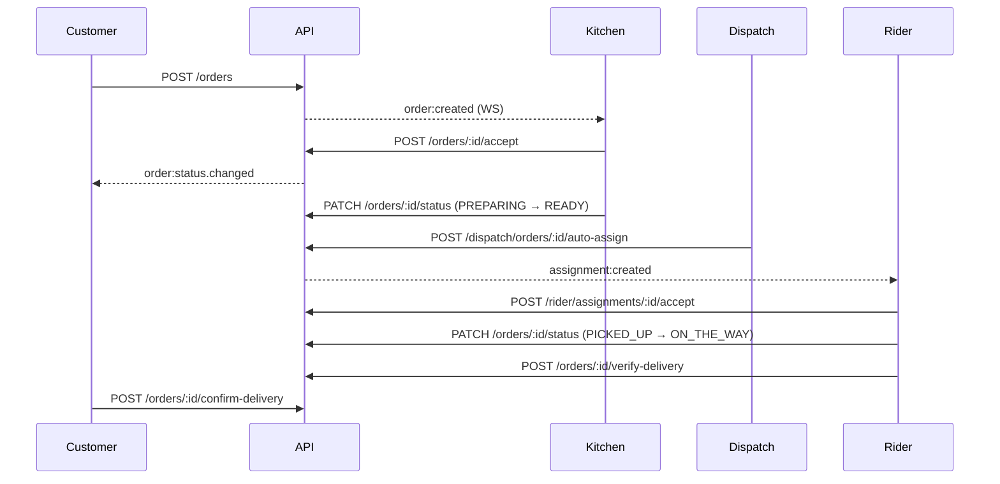

# Food Delivery API — Full Reference

Complete HTTP and WebSocket API documentation for the NestJS backend.

| | |
|---|---|
| **Base URL** | `http://localhost:3000/api/v1` (configurable via `API_PREFIX`) |
| **Interactive docs** | `http://localhost:3000/api/docs` (non-production only) |
| **WebSocket** | `ws://localhost:3000/realtime` (Socket.IO namespace) |
| **Stack** | NestJS 11 · PostgreSQL (Prisma) · JWT · Socket.IO |

For copy-paste request examples, see [SAMPLE_REQUESTS.md](./SAMPLE_REQUESTS.md).

---

## Table of Contents

1. [Overview](#overview)
2. [Authentication](#authentication)
3. [Error Handling](#error-handling)
4. [Enums & Constants](#enums--constants)
5. [Auth](#auth)
6. [Users](#users)
7. [Restaurant](#restaurant)
8. [Restaurant Admin](#restaurant-admin)
9. [Menu (Public)](#menu-public)
10. [Menu Admin](#menu-admin)
11. [Addresses](#addresses)
12. [Favorites](#favorites)
13. [Coupons](#coupons)
14. [Delivery Fee](#delivery-fee)
15. [Orders](#orders)
16. [Order Messages](#order-messages)
17. [Payments](#payments)
18. [Refunds](#refunds)
19. [Dispatch & Rider Assignments](#dispatch--rider-assignments)
20. [Rider](#rider)
21. [Earnings](#earnings)
22. [Reviews](#reviews)
23. [Complaints](#complaints)
24. [Complaints Admin](#complaints-admin)
25. [Notifications](#notifications)
26. [Devices](#devices)
27. [Admin](#admin)
28. [Reports](#reports)
29. [Uploads](#uploads)
30. [Media Admin](#media-admin)
31. [Print Events](#print-events)
32. [App Config](#app-config)
33. [Health](#health)
34. [Dev](#dev)
35. [Realtime WebSocket](#realtime-websocket)
36. [Order Lifecycle](#order-lifecycle)

---

## Overview

### Global behavior

- All routes are prefixed with `/api/v1` unless `API_PREFIX` is overridden.
- **Validation:** `whitelist: true`, `forbidNonWhitelisted: true`, `transform: true` — unknown fields are rejected.
- **Request body limit:** 1 MB for JSON and URL-encoded bodies.
- **Guards (global):** `JwtAuthGuard`, `RolesGuard`, `ThrottlerGuard`.
- Endpoints marked **Public** skip JWT authentication via `@Public()`.
- When no `@Roles()` is set on a route, any authenticated user may call it.

### Roles

| Role | Description |
|------|-------------|
| `CUSTOMER` | End-user placing orders |
| `RIDER` | Delivery driver |
| `OWNER` | Restaurant owner |
| `MANAGER` | Restaurant manager |
| `CASHIER` | Front-of-house / dispatch staff |
| `KITCHEN` | Kitchen display staff |
| `ADMIN` | Platform super-admin |

Staff roles (`OWNER`, `MANAGER`, `CASHIER`, `KITCHEN`) are scoped to their `restaurantId` from the JWT.

### Pagination

List endpoints that support pagination accept:

| Query | Type | Default | Constraints |
|-------|------|---------|-------------|
| `page` | integer | `1` | min `1` |
| `limit` | integer | `20` | min `1`, max `100` |

Paginated responses use:

```json
{
  "data": [],
  "meta": {
    "page": 1,
    "limit": 20,
    "total": 42,
    "totalPages": 3
  }
}
```

---

## Authentication

### Bearer token

Protected endpoints require:

```http
Authorization: Bearer <accessToken>
```

### Token response

Returned by `POST /auth/register`, `POST /auth/login`, `POST /auth/otp/verify`, `POST /auth/register/rider`, and `POST /auth/refresh`:

```json
{
  "accessToken": "eyJhbGciOiJIUzI1NiIs...",
  "refreshToken": "a1b2c3d4-...",
  "tokenType": "Bearer",
  "expiresIn": "15m",
  "user": {
    "sub": "uuid",
    "role": "CUSTOMER",
    "restaurantId": null,
    "branchId": null,
    "riderProfileId": null
  }
}
```

| Field | Notes |
|-------|-------|
| `accessToken` | Short-lived JWT (default 15m, `JWT_ACCESS_EXPIRES_IN`) |
| `refreshToken` | Opaque token stored server-side (default 7d, `JWT_REFRESH_EXPIRES_IN`) |
| `user.sub` | User ID |
| `user.restaurantId` | Set for staff roles |
| `user.riderProfileId` | Set for approved riders |

### Rate limits (auth routes)

Auth endpoints are throttled:

| Endpoint group | Limit |
|----------------|-------|
| register, login, OTP, forgot-password | 5 requests / minute |
| refresh | 10 requests / minute |

---

## Error Handling

All errors return:

```json
{
  "success": false,
  "statusCode": 400,
  "message": "Validation failed",
  "path": "/api/v1/orders",
  "requestId": "req-uuid",
  "timestamp": "2026-06-25T12:00:00.000Z"
}
```

| Status | Meaning |
|--------|---------|
| `400` | Validation error or bad request |
| `401` | Missing or invalid JWT |
| `403` | Insufficient role or resource access |
| `404` | Resource not found |
| `409` | Conflict (e.g. duplicate, invalid state transition) |
| `429` | Rate limit exceeded |
| `500` | Internal server error |
| `503` | Service degraded (health readiness) |

Validation errors may include an array in `message`.

---

## Enums & Constants

### OrderStatus

```
PLACED → ACCEPTED → PREPARING → READY_FOR_PICKUP → PICKED_UP → ON_THE_WAY → DELIVERED
                                                                              ↓
                                                                    DELIVERY_FAILED
                                                                              ↓
                                                              RETURNED_TO_RESTAURANT

Terminal: CANCELLED | REJECTED | IGNORED_TEST
```

### OrderType

`DELIVERY` · `PICKUP`

### PaymentMethod

`COD` · `ONLINE` · `WALLET`

### PaymentStatus

`PENDING` · `PAID` · `FAILED` · `REFUNDED`

### AssignmentStatus

`CREATED` · `NOTIFIED` · `ACCEPTED` · `REJECTED` · `EXPIRED` · `CANCELLED`

### UserStatus

`ACTIVE` · `INACTIVE` · `SUSPENDED`

### RiderApprovalStatus

`PENDING` · `APPROVED` · `REJECTED` · `SUSPENDED`

### AddressLabel

`HOME` · `OFFICE` · `OTHER`

### DevicePlatform

`ANDROID` · `IOS` · `WEB`

### OTP purpose

`LOGIN` · `RESET_PASSWORD` · `VERIFY_PHONE`

### Delivery exception reasons

`CUSTOMER_UNREACHABLE` · `WRONG_ADDRESS` · `ACCIDENT_EMERGENCY` · `CUSTOMER_REFUSED` · `APP_CRASH_MANUAL`

### Food disposition

`PENDING` · `DISCARDED` · `APPROVED_REDISPATCH`

### Refund request status

`PENDING` · `APPROVED` · `EXECUTED` · `FAILED` · `CANCELLED`

### Complaint status

`OPEN` · `IN_REVIEW` · `RESOLVED` · `REJECTED`

### Complaint type

`COMPLAINT` · `REFUND_REQUEST`

### Discount type

`PERCENT` · `FLAT`

### Rider document types

`NID` · `DRIVING_LICENSE` · `VEHICLE_REGISTRATION` · `INSURANCE` · `OTHER`

### Print types

`KITCHEN_TICKET` · `CUSTOMER_RECEIPT`

### Print status

`REQUESTED` · `SUCCESS` · `FAILED`

### Media category

`MENU` · `BANNER` · `CATEGORY` · `OTHER`

---

## Auth

Base path: `/auth`

| Method | Path | Auth | Description |
|--------|------|------|-------------|
| `POST` | `/auth/register` | Public | Register customer |
| `POST` | `/auth/register/rider` | Public | Register rider (pending approval) |
| `POST` | `/auth/login` | Public | Login with email or phone + password |
| `POST` | `/auth/otp/send` | Public | Send OTP |
| `POST` | `/auth/otp/verify` | Public | Verify OTP and login |
| `POST` | `/auth/forgot-password/reset` | Public | Reset password with OTP |
| `POST` | `/auth/refresh` | Public | Refresh access token |
| `POST` | `/auth/logout` | JWT | Revoke refresh token |

### POST `/auth/register`

**Body**

| Field | Type | Required | Constraints |
|-------|------|----------|-------------|
| `fullName` | string | yes | min 2 |
| `email` | string | no* | valid email |
| `phone` | string | no* | valid phone |
| `password` | string | yes | min 8 |

\* At least one of `email` or `phone` is required in practice.

**Response:** Token response (see [Authentication](#authentication)).

---

### POST `/auth/register/rider`

**Body**

| Field | Type | Required |
|-------|------|----------|
| `fullName` | string | yes (min 2) |
| `email` | string | yes |
| `phone` | string | yes |
| `password` | string | yes (min 8) |
| `vehicleType` | string | no |

**Response:** Token response + `approvalStatus: "PENDING"` and informational `message`.

---

### POST `/auth/login`

**Body**

| Field | Type | Required |
|-------|------|----------|
| `email` | string | no* |
| `phone` | string | no* |
| `password` | string | yes (min 8) |

\* Provide `email` or `phone`.

**Response:** Token response.

---

### POST `/auth/otp/send`

**Body**

| Field | Type | Required |
|-------|------|----------|
| `phone` | string | no* |
| `email` | string | no* |
| `purpose` | enum | yes — `LOGIN` \| `RESET_PASSWORD` \| `VERIFY_PHONE` |

**Response**

```json
{
  "success": true,
  "message": "OTP sent",
  "expiresAt": "2026-06-25T12:10:00.000Z",
  "devCode": "123456"
}
```

`devCode` is only returned in non-production for testing.

---

### POST `/auth/otp/verify`

**Body:** OTP send fields + `code` (string, length 6).

**Response:** Token response.

---

### POST `/auth/forgot-password/reset`

**Body**

| Field | Type | Required |
|-------|------|----------|
| `phone` | string | no* |
| `email` | string | no* |
| `code` | string | yes (6 chars) |
| `newPassword` | string | yes (8–64) |

**Response**

```json
{ "success": true, "message": "Password updated" }
```

---

### POST `/auth/refresh`

**Body**

```json
{ "refreshToken": "string" }
```

**Response:** Token response (new access + refresh tokens).

---

### POST `/auth/logout`

**Body**

```json
{ "refreshToken": "string" }
```

**Response**

```json
{ "success": true }
```

---

## Users

Base path: `/users`  
**Roles:** `CUSTOMER`, `OWNER`, `MANAGER`, `CASHIER`, `KITCHEN`, `RIDER`

| Method | Path | Roles | Description |
|--------|------|-------|-------------|
| `GET` | `/users/me` | all above | Current user profile |
| `PATCH` | `/users/me` | all above | Update profile |
| `PATCH` | `/users/rider/online` | `RIDER` | Set online/offline |

### PATCH `/users/me`

| Field | Type | Required |
|-------|------|----------|
| `fullName` | string | no (min 2) |
| `avatarUrl` | string | no |
| `phone` | string | no |

### PATCH `/users/rider/online`

```json
{ "isOnline": true }
```

---

## Restaurant

Base path: `/restaurant`

| Method | Path | Auth | Roles | Description |
|--------|------|------|-------|-------------|
| `GET` | `/restaurant/dashboard/stats` | JWT | `OWNER`, `MANAGER`, `CASHIER`, `KITCHEN` | Staff dashboard KPIs |
| `GET` | `/restaurant/slug/:slug` | Public | — | Restaurant by slug |
| `GET` | `/restaurant/:id` | Public | — | Restaurant by ID |

### GET `/restaurant/dashboard/stats`

**Response (example)**

```json
{
  "today": 12,
  "pending": 3,
  "active": 5,
  "completed": 4,
  "cancelled": 0
}
```

---

## Restaurant Admin

Base path: `/admin/restaurant`  
**Roles:** `OWNER`, `MANAGER`, `ADMIN` (profile also allows `KITCHEN`, `CASHIER`)

| Method | Path | Description |
|--------|------|-------------|
| `PATCH` | `/admin/restaurant/profile` | Update restaurant profile |
| `PATCH` | `/admin/restaurant/settings` | Update operational settings |
| `PATCH` | `/admin/restaurant/delivery-fee` | Update delivery fee config |
| `POST` | `/admin/restaurant/operating-hours/:day` | Upsert hours for day `0`–`6` |
| `GET` | `/admin/restaurant/banners` | List banners |
| `POST` | `/admin/restaurant/banners` | Create banner |
| `PATCH` | `/admin/restaurant/banners/:id` | Update banner |
| `DELETE` | `/admin/restaurant/banners/:id` | Delete banner |
| `GET` | `/admin/restaurant/coupons` | List coupons |
| `POST` | `/admin/restaurant/coupons` | Create coupon |
| `PATCH` | `/admin/restaurant/coupons/:id` | Update coupon |
| `DELETE` | `/admin/restaurant/coupons/:id` | Delete coupon |
| `GET` | `/admin/restaurant/zones` | List delivery zones |
| `POST` | `/admin/restaurant/zones` | Create zone |
| `PATCH` | `/admin/restaurant/zones/:id` | Update zone |
| `DELETE` | `/admin/restaurant/zones/:id` | Delete zone |

### PATCH `/admin/restaurant/profile` (all optional)

`name`, `description`, `phone`, `email`, `logoUrl`, `addressLine`, `city`, `country`, `latitude`, `longitude`, `isActive`

### PATCH `/admin/restaurant/settings` (all optional)

`taxRatePercent`, `packagingFee`, `currency`, `minOrderAmount`, `autoAcceptOrders`, `defaultPrepMinutes`, `assignmentTimeoutSec`, `slaAcceptSeconds`, `slaPrepSeconds`, `slaPickupWaitSeconds`, `showTestOrdersInKitchen`

### PATCH `/admin/restaurant/delivery-fee` (all optional)

`baseFee`, `perKmFee`, `peakHourSurcharge`, `freeDeliveryThreshold`, `peakHours` (object), `maxDeliveryKm`

### POST `/admin/restaurant/operating-hours/:day`

| Field | Type | Required |
|-------|------|----------|
| `openTime` | string | yes — `HH:MM` |
| `closeTime` | string | yes — `HH:MM` |
| `isClosed` | boolean | no |

### POST `/admin/restaurant/banners`

| Field | Type | Required |
|-------|------|----------|
| `title` | string | yes |
| `imageUrl` | string | yes |
| `linkUrl` | string | no |
| `sortOrder` | number | no |
| `isActive` | boolean | no |
| `startsAt` | ISO date | no |
| `endsAt` | ISO date | no |

### POST `/admin/restaurant/coupons`

| Field | Type | Required |
|-------|------|----------|
| `code` | string | yes |
| `description` | string | no |
| `discountType` | enum | yes — `PERCENT` \| `FLAT` |
| `discountValue` | number | yes |
| `minOrderAmount` | number | no |
| `maxUses` | number | no |
| `startsAt` | ISO date | no |
| `endsAt` | ISO date | no |
| `isActive` | boolean | no |
| `perUserLimit` | number | no |
| `newCustomersOnly` | boolean | no |
| `targetCustomerIdentifier` | string | no |

### POST `/admin/restaurant/zones`

| Field | Type | Required |
|-------|------|----------|
| `name` | string | yes |
| `polygonGeo` | GeoJSON object | no |
| `maxDistanceKm` | number | no |
| `isActive` | boolean | no |

---

## Menu (Public)

Base path: `/menu` — **all routes are public**

| Method | Path | Description |
|--------|------|-------------|
| `GET` | `/menu/restaurant/:restaurantId` | Full menu (categories + items) |
| `GET` | `/menu/restaurant/:restaurantId/featured` | Featured items |
| `GET` | `/menu/items/:itemId` | Single menu item |
| `GET` | `/menu/restaurant/:restaurantId/banners` | Active banners |
| `GET` | `/menu/restaurant/:restaurantId/filter` | Filter items |
| `GET` | `/menu/restaurant/:restaurantId/search` | Search items |

### GET `/menu/restaurant/:restaurantId/filter`

| Query | Type |
|-------|------|
| `categoryId` | uuid |
| `minPrice` | number |
| `maxPrice` | number |
| `availableOnly` | boolean |
| `featuredOnly` | boolean |
| `q` | string |

### GET `/menu/restaurant/:restaurantId/search`

| Query | Type | Required |
|-------|------|----------|
| `q` | string | yes |

---

## Menu Admin

Base path: `/admin/menu`  
**Roles:** `OWNER`, `MANAGER`, `CASHIER`, `KITCHEN`, `ADMIN`

| Method | Path | Description |
|--------|------|-------------|
| `GET` | `/admin/menu` | Full menu for staff restaurant |
| `POST` | `/admin/menu/categories` | Create category |
| `PATCH` | `/admin/menu/categories/:id` | Update category |
| `DELETE` | `/admin/menu/categories/:id` | Delete category |
| `POST` | `/admin/menu/items` | Create menu item |
| `PATCH` | `/admin/menu/items/:id` | Update menu item |
| `DELETE` | `/admin/menu/items/:id` | Delete menu item |
| `GET` | `/admin/menu/addons` | List addons |
| `POST` | `/admin/menu/addons` | Create addon |
| `PATCH` | `/admin/menu/addons/:id` | Update addon |
| `DELETE` | `/admin/menu/addons/:id` | Delete addon |
| `POST` | `/admin/menu/items/:itemId/addons/:addonId` | Link addon to item |
| `DELETE` | `/admin/menu/items/:itemId/addons/:addonId` | Unlink addon |

Category, item, and addon create/update bodies accept flexible fields (name, description, price, imageUrl, sortOrder, isAvailable, isFeatured, categoryId, etc.) scoped to the staff member's restaurant.

---

## Addresses

Base path: `/addresses`  
**Roles:** `CUSTOMER`

| Method | Path | Description |
|--------|------|-------------|
| `GET` | `/addresses` | List saved addresses |
| `POST` | `/addresses` | Create address |
| `PATCH` | `/addresses/:id` | Update address |
| `DELETE` | `/addresses/:id` | Delete address |

### POST / PATCH body

| Field | Type | Required |
|-------|------|----------|
| `label` | enum | yes — `HOME` \| `OFFICE` \| `OTHER` |
| `line1` | string | yes |
| `line2` | string | no |
| `city` | string | no |
| `postalCode` | string | no |
| `instructions` | string | no |
| `latitude` | number | yes |
| `longitude` | number | yes |
| `isDefault` | boolean | no |

---

## Favorites

Base path: `/favorites`  
**Roles:** `CUSTOMER`

| Method | Path | Description |
|--------|------|-------------|
| `GET` | `/favorites` | List favorited menu items |
| `POST` | `/favorites/:menuItemId` | Add favorite |
| `DELETE` | `/favorites/:menuItemId` | Remove favorite |

---

## Coupons

Base path: `/coupons`

| Method | Path | Auth | Description |
|--------|------|------|-------------|
| `GET` | `/coupons/public` | Public | Active public coupons |
| `POST` | `/coupons/validate` | Public | Validate coupon against subtotal |

### GET `/coupons/public`

| Query | Type | Required |
|-------|------|----------|
| `restaurantId` | uuid | yes |

### POST `/coupons/validate`

```json
{
  "restaurantId": "uuid",
  "code": "SAVE10",
  "subtotal": 500
}
```

**Response:** validation result with discount amount and applicability.

---

## Delivery Fee

Base path: `/delivery-fee`

| Method | Path | Auth | Description |
|--------|------|------|-------------|
| `POST` | `/delivery-fee/quote` | JWT | Calculate delivery fee |
| `GET` | `/delivery-fee/geocode` | Public | Geocode address string |
| `GET` | `/delivery-fee/reverse-geocode` | Public | Coordinates → address |

### POST `/delivery-fee/quote`

```json
{
  "restaurantId": "uuid",
  "deliveryLat": 23.815,
  "deliveryLng": 90.420,
  "subtotal": 500
}
```

### GET `/delivery-fee/geocode`

| Query | Required |
|-------|----------|
| `address` | yes |

### GET `/delivery-fee/reverse-geocode`

| Query | Required |
|-------|----------|
| `lat` | yes |
| `lng` | yes |

---

## Orders

Base path: `/orders`

| Method | Path | Roles | Description |
|--------|------|-------|-------------|
| `POST` | `/orders` | `CUSTOMER` | Place order |
| `GET` | `/orders` | `CUSTOMER`, staff, `RIDER` | List orders (paginated) |
| `GET` | `/orders/kitchen/history` | `OWNER`, `MANAGER`, `CASHIER`, `KITCHEN` | Kitchen order history |
| `GET` | `/orders/kitchen/stats` | `OWNER`, `MANAGER`, `CASHIER`, `KITCHEN` | Kitchen stats |
| `GET` | `/orders/ops/queues` | `OWNER`, `MANAGER`, `CASHIER`, `ADMIN` | Ops queue overview |
| `GET` | `/orders/:id` | `CUSTOMER`, staff, `RIDER` | Order detail |
| `POST` | `/orders/:id/accept` | staff kitchen roles | Accept order |
| `POST` | `/orders/:id/reject` | staff kitchen roles | Reject order |
| `POST` | `/orders/:id/cancel` | `CUSTOMER`, `OWNER`, `MANAGER`, `CASHIER` | Cancel order |
| `POST` | `/orders/:id/reorder` | `CUSTOMER` | Reorder from past order |
| `PATCH` | `/orders/:id/status` | staff + `RIDER` | Update status |
| `POST` | `/orders/:id/delivery-exception` | `RIDER` | Report delivery failure |
| `POST` | `/orders/:id/resolve-exception` | `OWNER`, `MANAGER`, `CASHIER`, `ADMIN` | Resolve exception |
| `POST` | `/orders/:id/food-disposition` | kitchen staff | Food disposition after failed delivery |
| `POST` | `/orders/:id/verify-delivery` | `RIDER` | Verify delivery OTP |
| `POST` | `/orders/:id/dispatch-external` | `OWNER`, `MANAGER`, `CASHIER` | External courier dispatch |
| `POST` | `/orders/:id/confirm-delivery` | `CUSTOMER` | Customer confirms receipt |

### POST `/orders` — Place order

| Field | Type | Required |
|-------|------|----------|
| `restaurantId` | uuid | yes |
| `orderType` | enum | yes — `DELIVERY` \| `PICKUP` |
| `paymentMethod` | enum | yes — `COD` \| `ONLINE` \| `WALLET` |
| `items` | array | yes |
| `items[].menuItemId` | uuid | yes |
| `items[].quantity` | number | yes (min 1) |
| `items[].notes` | string | no |
| `items[].addons` | array | no |
| `items[].addons[].addonId` | uuid | yes |
| `items[].addons[].name` | string | no |
| `items[].addons[].price` | number | no |
| `couponCode` | string | no |
| `deliveryAddress` | string | no* |
| `deliveryLat` | number | no* |
| `deliveryLng` | number | no* |
| `deliveryNote` | string | no |
| `customerName` | string | no |
| `customerPhone` | string | no |
| `idempotencyKey` | string | no (max 128) |

\* Required for `DELIVERY` orders.

### GET `/orders`

Query: `page`, `limit` (see [Pagination](#pagination)).

### GET `/orders/kitchen/history`

| Query | Type |
|-------|------|
| `date` | string (`YYYY-MM-DD`) |
| `includeTest` | `'true'` |

### GET `/orders/kitchen/stats`

| Query | Type |
|-------|------|
| `period` | string |
| `includeTest` | `'true'` |

### POST `/orders/:id/accept`

```json
{ "prepMinutes": 25 }
```

`prepMinutes`: integer, 1–120, optional.

### POST `/orders/:id/reject`

```json
{ "note": "Out of stock" }
```

`note`: max 500 chars, optional.

### POST `/orders/:id/cancel`

```json
{ "reason": "Changed my mind" }
```

### POST `/orders/:id/delivery-exception`

| Field | Type | Required |
|-------|------|----------|
| `reason` | enum | yes (see [Delivery exception reasons](#delivery-exception-reasons)) |
| `note` | string | no |
| `photoUrl` | url | no |
| `latitude` | number | no |
| `longitude` | number | no |
| `foodReturned` | boolean | no |

### POST `/orders/:id/resolve-exception`

| Field | Type | Required |
|-------|------|----------|
| `action` | enum | yes — `REASSIGN` \| `CANCEL_REFUND` \| `CLONE_REORDER` \| `RESOLVED_NO_REFUND` |
| `note` | string | no |

### POST `/orders/:id/food-disposition`

```json
{ "disposition": "PENDING" }
```

### POST `/orders/:id/verify-delivery`

| Field | Type | Required |
|-------|------|----------|
| `otp` | string | yes (4–6 chars) |
| `dropoffPhotoUrl` | string | no |
| `pickupExperience` | string | no |

### POST `/orders/:id/dispatch-external`

| Field | Type | Required |
|-------|------|----------|
| `deliveryService` | string | yes |
| `trackingId` | string | no |
| `trackingUrl` | string | no |

### PATCH `/orders/:id/status`

| Field | Type | Required |
|-------|------|----------|
| `status` | OrderStatus | yes |
| `note` | string | no |
| `prepMinutes` | integer | no (min 1) |

---

## Order Messages

Base path: `/orders/:orderId/messages`  
**Roles:** `CUSTOMER`, `RIDER`, `OWNER`, `MANAGER`, `CASHIER`, `ADMIN`

| Method | Path | Description |
|--------|------|-------------|
| `GET` | `/orders/:orderId/messages` | List messages |
| `POST` | `/orders/:orderId/messages` | Send message |

### POST body

```json
{ "body": "I'm at the gate" }
```

`body`: string, 1–1000 characters.

---

## Payments

Base path: `/payments`  
**Roles:** `CUSTOMER`

| Method | Path | Description |
|--------|------|-------------|
| `POST` | `/payments/orders/:orderId/online/initiate` | Start online payment (bKash / SSLCommerz) |
| `POST` | `/payments/orders/:orderId/online/execute` | Execute after gateway redirect |
| `POST` | `/payments/orders/:orderId/wallet` | Pay from wallet balance |

### POST `/payments/orders/:orderId/online/execute`

```json
{ "paymentId": "gateway-payment-id" }
```

Gateway is configured via `PAYMENT_GATEWAY` (`bkash` or `sslcommerz`).

---

## Refunds

Base path: `/admin/refunds`  
**Roles:** `OWNER`, `MANAGER`, `ADMIN`

| Method | Path | Description |
|--------|------|-------------|
| `GET` | `/admin/refunds/pending` | Pending refund requests |
| `POST` | `/admin/refunds` | Create refund request |
| `PATCH` | `/admin/refunds/:id` | Update refund status |

Non-`ADMIN` users see only their restaurant's refunds.

### POST `/admin/refunds`

| Field | Type | Required |
|-------|------|----------|
| `orderId` | uuid | yes |
| `amount` | number | yes (min 0.01) |
| `reason` | string | yes |

### PATCH `/admin/refunds/:id`

| Field | Type | Required |
|-------|------|----------|
| `status` | enum | yes — refund request status |
| `adminNote` | string | no |
| `gatewayRef` | string | no |

---

## Dispatch & Rider Assignments

| Method | Path | Roles | Description |
|--------|------|-------|-------------|
| `GET` | `/dispatch/riders/available` | `OWNER`, `MANAGER`, `CASHIER` | Available riders |
| `POST` | `/dispatch/orders/:orderId/auto-assign` | `OWNER`, `MANAGER`, `CASHIER` | Auto-assign nearest rider |
| `POST` | `/dispatch/orders/:orderId/assign` | `OWNER`, `MANAGER`, `CASHIER` | Manual assign |
| `POST` | `/dispatch/orders/:orderId/force-unassign` | `OWNER`, `MANAGER`, `CASHIER`, `ADMIN` | Force unassign |
| `GET` | `/rider/assignments/pending` | `RIDER` | Pending assignment offers |
| `POST` | `/rider/assignments/accept-batch` | `RIDER` | Accept multiple (1–20) |
| `POST` | `/rider/assignments/:id/accept` | `RIDER` | Accept single |
| `POST` | `/rider/assignments/:id/reject` | `RIDER` | Reject offer |

### POST `/dispatch/orders/:orderId/assign`

```json
{ "riderProfileId": "uuid" }
```

### POST `/rider/assignments/accept-batch`

```json
{ "assignmentIds": ["uuid", "uuid"] }
```

### POST `/dispatch/orders/:orderId/force-unassign`

```json
{ "reason": "Rider unavailable" }
```

Assignment timeout defaults to 45 seconds (`ASSIGNMENT_TIMEOUT_SECONDS`).

---

## Rider

Base path: `/rider`  
**Roles:** `RIDER`

| Method | Path | Description |
|--------|------|-------------|
| `GET` | `/rider/profile` | Rider profile |
| `PATCH` | `/rider/profile` | Update profile |
| `GET` | `/rider/documents` | List uploaded documents |
| `POST` | `/rider/documents` | Upload document (multipart) |

### PATCH `/rider/profile` (all optional)

`vehicleType`, `vehicleModel`, `vehicleRegistration`, `zone`

### POST `/rider/documents`

**Content-Type:** `multipart/form-data`

| Field | Type | Constraints |
|-------|------|-------------|
| `file` | binary | max 5 MB, JPEG/PNG/WebP |
| `type` | enum | `NID` \| `DRIVING_LICENSE` \| `VEHICLE_REGISTRATION` \| `INSURANCE` \| `OTHER` |

---

## Earnings

Base path: `/earnings`  
**Roles:** `OWNER`, `MANAGER`, `ADMIN`

| Method | Path | Description |
|--------|------|-------------|
| `GET` | `/earnings/riders/:riderId/ledger` | Balance, ledger entries, payouts |
| `POST` | `/earnings/riders/:riderId/payouts` | Record payout |
| `GET` | `/earnings/cod-settlements/pending` | Pending COD remittances |
| `POST` | `/earnings/cod-settlements/:orderId/settle` | Settle COD |

### GET `/earnings/riders/:riderId/ledger`

```json
{
  "riderId": "uuid",
  "balance": 1250.50,
  "entries": [],
  "payouts": []
}
```

### POST `/earnings/riders/:riderId/payouts`

| Field | Type | Required |
|-------|------|----------|
| `amount` | number | yes (min 0.01) |
| `reference` | string | no |
| `note` | string | no |

### GET `/earnings/cod-settlements/pending`

| Query | Notes |
|-------|-------|
| `restaurantId` | Required for `ADMIN`; auto-scoped for staff |

### POST `/earnings/cod-settlements/:orderId/settle`

| Field | Type | Required |
|-------|------|----------|
| `foodAmountRemitted` | number | no |
| `note` | string | no |

---

## Reviews

Base path: `/reviews`

| Method | Path | Auth | Roles | Description |
|--------|------|------|-------|-------------|
| `POST` | `/reviews/orders/:orderId` | JWT | `CUSTOMER` | Submit review |
| `GET` | `/reviews/restaurant/:restaurantId` | Public | — | List reviews |

### POST body

| Field | Type | Required |
|-------|------|----------|
| `rating` | integer | yes (1–5) |
| `comment` | string | no |

---

## Complaints

Base path: `/complaints`  
**Roles:** `CUSTOMER`

| Method | Path | Description |
|--------|------|-------------|
| `POST` | `/complaints` | Create complaint or refund request |
| `GET` | `/complaints/me` | List own complaints |

### POST body

| Field | Type | Required |
|-------|------|----------|
| `orderId` | uuid | yes |
| `type` | enum | yes — `COMPLAINT` \| `REFUND_REQUEST` |
| `subject` | string | yes (min 3) |
| `description` | string | yes (min 10) |
| `refundAmount` | number | no (min 0) |

---

## Complaints Admin

Base path: `/admin/complaints`  
**Roles:** `OWNER`, `MANAGER`, `CASHIER`

| Method | Path | Description |
|--------|------|-------------|
| `GET` | `/admin/complaints` | List restaurant complaints |
| `PATCH` | `/admin/complaints/:id` | Update complaint |

### GET query

| Query | Values |
|-------|--------|
| `status` | `OPEN` \| `IN_REVIEW` \| `RESOLVED` \| `REJECTED` |

### PATCH body (all optional)

`status`, `staffNote`, `refundAmount`

---

## Notifications

Base path: `/notifications`  
**Auth:** any authenticated user

| Method | Path | Description |
|--------|------|-------------|
| `GET` | `/notifications` | Last 50 notifications |
| `PATCH` | `/notifications/:id/read` | Mark as read |

### Notification object

| Field | Type |
|-------|------|
| `id` | uuid |
| `userId` | uuid |
| `title` | string |
| `body` | string |
| `data` | object |
| `readAt` | ISO date \| null |
| `createdAt` | ISO date |

---

## Devices

Base path: `/devices`  
**Roles:** `CUSTOMER`, `RIDER`, `OWNER`, `MANAGER`, `CASHIER`, `KITCHEN`

| Method | Path | Description |
|--------|------|-------------|
| `POST` | `/devices/register` | Register FCM push token |
| `POST` | `/devices/refresh-token` | Update token for existing device |

### Body (both endpoints)

| Field | Type | Required |
|-------|------|----------|
| `deviceId` | string | yes |
| `platform` | enum | yes — `ANDROID` \| `IOS` \| `WEB` |
| `token` | string | yes |

---

## Admin

Base path: `/admin`  
**Roles:** `OWNER`, `MANAGER`, `ADMIN` (super routes: `ADMIN` only)

| Method | Path | Roles | Description |
|--------|------|-------|-------------|
| `GET` | `/admin/dashboard/stats` | staff + `ADMIN` | Restaurant dashboard KPIs |
| `GET` | `/admin/reports/daily-revenue` | staff + `ADMIN` | Daily revenue chart |
| `GET` | `/admin/orders` | staff + `ADMIN` | List restaurant orders |
| `GET` | `/admin/users` | staff + `ADMIN` | List users |
| `GET` | `/admin/users/:id` | staff + `ADMIN` | User detail |
| `PATCH` | `/admin/users/:id/status` | staff + `ADMIN` | Suspend / activate user |
| `GET` | `/admin/riders` | staff + `ADMIN` | List riders |
| `GET` | `/admin/riders/pending` | staff + `ADMIN` | Pending rider approvals |
| `PATCH` | `/admin/riders/:id/approve` | staff + `ADMIN` | Approve / reject / suspend rider |
| `PATCH` | `/admin/riders/documents/:docId` | staff + `ADMIN` | Approve / reject document |
| `GET` | `/admin/audit-logs` | staff + `ADMIN` | Audit log (paginated) |
| `GET` | `/admin/super/stats` | `ADMIN` | Platform-wide stats |
| `GET` | `/admin/super/revenue` | `ADMIN` | Global daily revenue |
| `GET` | `/admin/super/orders` | `ADMIN` | All platform orders |
| `GET` | `/admin/super/orders/:id` | `ADMIN` | Global order detail |
| `GET` | `/admin/super/restaurants` | `ADMIN` | All restaurants |
| `GET` | `/admin/super/restaurants/:id` | `ADMIN` | Restaurant detail |

### GET `/admin/reports/daily-revenue` & `/admin/super/revenue`

| Query | Default |
|-------|---------|
| `days` | `7` |

### GET `/admin/orders`

| Query | Type |
|-------|------|
| `page`, `limit` | pagination |
| `status` | OrderStatus |
| `from`, `to` | ISO date |
| `search` | string |

### GET `/admin/super/orders`

| Query | Type |
|-------|------|
| `page`, `limit` | pagination |
| `status` | OrderStatus |
| `restaurantId` | uuid |
| `search` | string |

### GET `/admin/users`

| Query | Type |
|-------|------|
| `page`, `limit` | pagination |
| `role` | UserRole |
| `search` | string |

### GET `/admin/super/restaurants`

| Query | Type |
|-------|------|
| `page`, `limit` | pagination |
| `search` | string |

### PATCH `/admin/users/:id/status`

```json
{ "status": "SUSPENDED" }
```

### PATCH `/admin/riders/:id/approve`

```json
{ "status": "APPROVED" }
```

Values: `APPROVED` \| `REJECTED` \| `SUSPENDED`

### PATCH `/admin/riders/documents/:docId`

```json
{ "status": "APPROVED" }
```

Values: `PENDING` \| `APPROVED` \| `REJECTED`

---

## Reports

Base path: `/reports`

| Method | Path | Roles | Description |
|--------|------|-------|-------------|
| `GET` | `/reports/sales` | `OWNER`, `MANAGER`, `ADMIN` | Sales summary |
| `GET` | `/reports/popular-items` | `OWNER`, `MANAGER`, `ADMIN` | Top menu items |
| `GET` | `/reports/earnings` | `OWNER`, `MANAGER`, `ADMIN` | Restaurant earnings |
| `GET` | `/reports/riders` | `OWNER`, `MANAGER`, `ADMIN` | Rider performance |
| `GET` | `/reports/rider/earnings` | `RIDER` | Own earnings |
| `GET` | `/reports/rider/performance` | `RIDER` | Own quality metrics |
| `GET` | `/reports/rider/cash` | `RIDER` | Own cash summary |

### Query params

| Endpoint | Query | Default |
|----------|-------|---------|
| `/reports/sales`, `/reports/earnings` | `period` — `day` \| `week` \| `month` | `day` |
| `/reports/popular-items` | `limit` | `4` |
| `/reports/rider/*` | `period` — `day` \| `week` \| `month` \| `all` | — |

---

## Uploads

Base path: `/uploads`

All endpoints use `multipart/form-data` with field `file` (max 5 MB, JPEG/PNG/WebP).

| Method | Path | Roles | Description |
|--------|------|-------|-------------|
| `POST` | `/uploads/image` | `OWNER`, `MANAGER`, `CASHIER` | Menu image |
| `POST` | `/uploads/image/banner` | `OWNER`, `MANAGER` | Banner image |
| `POST` | `/uploads/avatar` | `CUSTOMER`, `RIDER` | User avatar |
| `POST` | `/uploads/image/delivery-proof` | `RIDER` | Delivery proof photo |

**Response**

```json
{
  "url": "https://res.cloudinary.com/...",
  "publicId": "food-delivery/..."
}
```

Files are stored on Cloudinary when configured.

---

## Media Admin

Base path: `/admin/media`  
**Roles:** `OWNER`, `MANAGER`, `ADMIN`

| Method | Path | Description |
|--------|------|-------------|
| `GET` | `/admin/media` | List media assets |
| `POST` | `/admin/media` | Upload asset |
| `DELETE` | `/admin/media/:id` | Delete asset |

### GET query

| Query | Values |
|-------|--------|
| `category` | `MENU` \| `BANNER` \| `CATEGORY` \| `OTHER` |

### POST

`multipart/form-data`: `file` + optional query `category` (default `OTHER`).

---

## Print Events

Base path: `/print-events`  
**Roles:** `OWNER`, `MANAGER`, `CASHIER`, `KITCHEN`

| Method | Path | Description |
|--------|------|-------------|
| `POST` | `/print-events/log` | Log print event + realtime emit |
| `GET` | `/print-events/orders/:orderId` | Print history for order |

### POST body

| Field | Type | Required |
|-------|------|----------|
| `orderId` | string | yes |
| `printType` | enum | yes — `KITCHEN_TICKET` \| `CUSTOMER_RECEIPT` |
| `status` | enum | yes — `REQUESTED` \| `SUCCESS` \| `FAILED` |
| `deviceInfo` | string | no |

---

## App Config

Base path: `/app`

| Method | Path | Auth | Description |
|--------|------|------|-------------|
| `GET` | `/app/config` | Public | Force-update / bootstrap config |

**Response**

```json
{
  "minSupportedVersion": "1.0.0",
  "latestVersion": "1.0.0",
  "android": { "updateUrl": "" },
  "ios": { "updateUrl": "" }
}
```

Configured via `MIN_APP_VERSION`, `LATEST_APP_VERSION`, `ANDROID_UPDATE_URL`, `IOS_UPDATE_URL`.

---

## Health

Base path: `/health` — **all public**

| Method | Path | Description |
|--------|------|-------------|
| `GET` | `/health/live` | Liveness probe |
| `GET` | `/health/ready` | Readiness (DB + Redis) |
| `GET` | `/health` | Legacy combined check |

### GET `/health/live` → 200

```json
{
  "status": "ok",
  "service": "food-delivery-api",
  "timestamp": "2026-06-25T12:00:00.000Z"
}
```

### GET `/health/ready` → 200 or 503

```json
{
  "status": "ok",
  "service": "food-delivery-api",
  "timestamp": "2026-06-25T12:00:00.000Z",
  "database": "ok",
  "redis": "ok"
}
```

`redis` may be `"not_configured"` when `REDIS_URL` is unset.

---

## Dev

Base path: `/dev` — **non-production only** (returns 404 in production)

| Method | Path | Auth | Description |
|--------|------|------|-------------|
| `GET` | `/dev/client-config` | Public | LAN API URL for local Flutter dev |

Used by the backend startup script to sync `dev_host.json` into Flutter apps.

---

## Realtime WebSocket

**Namespace:** `/realtime` (Socket.IO)  
**URL:** `ws://<host>:<port>/realtime`

### Connection

Authenticate with either:

- `handshake.auth.token` = JWT access token, or
- `Authorization: Bearer <token>` header

On success, the server auto-joins rooms:

| Room | Condition |
|------|-----------|
| `user:{userId}` | always |
| `restaurant:{restaurantId}` | staff with `restaurantId` |
| `rider:{userId}` | `RIDER` role |

Inactive users or invalid/expired tokens are disconnected.

### Client → Server events

#### `order:join`

Join an order room for live updates.

**Payload**

```json
{ "orderId": "uuid" }
```

**Access:** order customer, restaurant staff (same restaurant), or assigned rider.

**Response**

```json
{ "joined": "order:uuid" }
```

Errors: `unauthorized`, `forbidden`, `rate_limited`.

Rate limit: 300 ms between calls per client.

---

#### `rider:location`

Stream rider GPS during active delivery.

**Payload**

```json
{
  "orderId": "uuid",
  "latitude": 23.815,
  "longitude": 90.420,
  "heading": 180
}
```

**Access:** `RIDER` with `ACCEPTED` assignment on the order.

**Response:** `{ "ok": true }` or `{ "ok": false, "error": "forbidden" | "rate_limited" }`

Rate limit: 800 ms between updates per client.

---

### Server → Client events

| Event | Rooms | Description |
|-------|-------|-------------|
| `order:status.changed` | `order:{orderId}` | Order status update |
| `order:created` | `restaurant:{restaurantId}` | New order placed |
| `assignment:created` | `rider:{userId}`, `order:{orderId}`, `restaurant:{restaurantId}` | Rider offer created |
| `assignment:accepted` | `order:{orderId}`, `restaurant:{restaurantId}` | Rider accepted |
| `assignment:rejected` | `order:{orderId}`, `restaurant:{restaurantId}` | Rider rejected |
| `assignment:expired` | `order:{orderId}`, `restaurant:{restaurantId}`, `rider:{userId}` | Offer timed out |
| `rider:location.updated` | `order:{orderId}` | Live rider position |

**`rider:location.updated` payload**

```json
{
  "riderId": "uuid",
  "latitude": 23.815,
  "longitude": 90.420,
  "heading": 180,
  "recordedAt": "2026-06-25T12:00:00.000Z"
}
```

### Socket.IO client example

```javascript
import { io } from 'socket.io-client';

const socket = io('http://localhost:3000/realtime', {
  auth: { token: accessToken },
});

socket.on('connect', () => {
  socket.emit('order:join', { orderId }, (res) => console.log(res));
});

socket.on('order:status.changed', (payload) => {
  console.log('Status:', payload);
});
```

---

## Order Lifecycle

Typical **delivery** flow:



**Pickup** orders skip dispatch and rider steps; status moves from `READY_FOR_PICKUP` to `DELIVERED` when collected.

---

## Endpoint Summary

| Module | Endpoints |
|--------|-----------|
| Auth | 8 |
| Users | 3 |
| Restaurant | 3 |
| Restaurant Admin | 16 |
| Menu (public) | 6 |
| Menu Admin | 13 |
| Addresses | 4 |
| Favorites | 3 |
| Coupons | 2 |
| Delivery Fee | 3 |
| Orders | 17 |
| Order Messages | 2 |
| Payments | 3 |
| Refunds | 3 |
| Dispatch & Assignments | 8 |
| Rider | 4 |
| Earnings | 4 |
| Reviews | 2 |
| Complaints | 2 |
| Complaints Admin | 2 |
| Notifications | 2 |
| Devices | 2 |
| Admin | 17 |
| Reports | 7 |
| Uploads | 4 |
| Media Admin | 3 |
| Print Events | 2 |
| App Config | 1 |
| Health | 3 |
| Dev | 1 |
| **WebSocket** | 2 client events, 7 server events |
| **Total HTTP** | ~130 |

---

## Demo Credentials

After running the database seed:

| Role | Login | Password |
|------|-------|----------|
| Owner | `owner@demokitchen.com` | `Password123!` |
| Customer | `customer@example.com` | `Password123!` |
| Rider | `+8801700000002` | `Password123!` |

---

*Generated from the NestJS backend controllers and DTOs. For interactive exploration, run the API in development and open `/api/docs`.*
