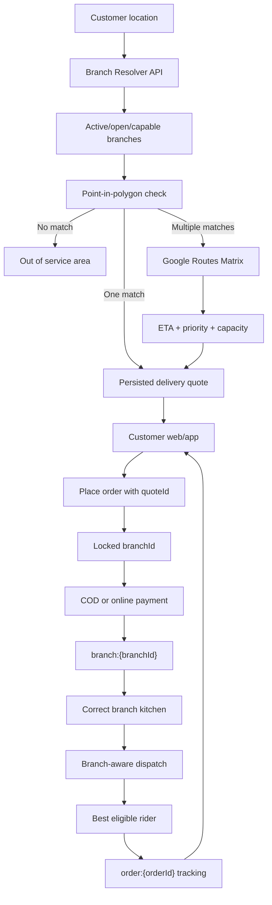

# ১০-ব্রাঞ্চ লোকেশন-বেজড ডেলিভারি — Implementation Plan

**Status:** `BLOCKED_ON_GOOGLE_MAPS_CREDENTIALS`  
**Recorded:** 2026-08-08  
**Workspace:** `C:\Users\riads\Desktop\Food_delivery`  
**Source of truth:** এই document-টিই ১০-ব্রাঞ্চ implementation-এর canonical plan।  
**Start condition:** Google Maps Platform project, billing, প্রয়োজনীয় APIs এবং restricted keys প্রস্তুত হওয়ার পর implementation শুরু হবে।

## 1. Objective

একটি restaurant brand-এর অধীনে ১০টি branch পরিচালনা করা, যেখানে customer location অনুযায়ী backend:

1. eligible delivery branches বের করবে;
2. overlap থাকলে ETA, priority ও capacity দিয়ে branch নির্বাচন করবে;
3. server-authoritative delivery quote তৈরি করবে;
4. order-এ branch lock করবে;
5. সঠিক kitchen-এ order পাঠাবে;
6. branch pickup location অনুযায়ী rider assign করবে;
7. customer-কে live rider tracking দেখাবে।

## 2. Scope and constraints

### Included

- PostgreSQL/Prisma branch-domain migration
- Branch-level zones, fees, hours and menu availability
- Branch resolver and short-lived delivery quote
- Branch-aware order, payment, kitchen, dispatch and realtime flow
- Admin branch switcher and polygon editor
- Customer web and Flutter customer branch/location state
- Mapbox-to-Google Maps migration
- Google Places, Geocoding and Routes API integration
- Automated tests, migration verification and production cutover

### Deferred

- Microservice split
- PostGIS dependency
- Multi-order fleet route optimization
- Automated travel-time isochrone generation
- Multi-region infrastructure

The existing NestJS modular monolith and PostgreSQL database will remain. Ten branches do not require a microservice rewrite.

## 3. Current-state audit

### Already available

- `Restaurant` and `Branch` Prisma models
- Nullable `Order.branchId`
- Restaurant-level radius and GeoJSON zones
- Backend point-in-polygon enforcement
- Delivery quote and dynamic fee calculation
- Kitchen order flow and online-payment gate
- Rider locations, assignment expiry and proximity scoring
- Socket.IO realtime events
- Rider SDK-neutral `RouteService` and `AppMapView`
- Customer Mapbox markers, routes and delivery-zone rendering

### Blocking gaps

- Zones, fees and hours are restaurant-level rather than branch-level.
- Delivery quote requires a client-selected `restaurantId`; no automatic branch resolver exists.
- `placeOrder()` does not set `branchId` for new customer orders.
- Kitchen queries/socket rooms are restaurant-scoped, so branch kitchens are not isolated.
- Rider scoring uses restaurant coordinates rather than selected branch coordinates.
- Admin branch switcher is disabled.
- Web admin supports radius only; Flutter admin requires raw GeoJSON paste.
- Customer web/app resolve a fixed restaurant instead of a location-selected branch.
- Backend Google routing uses the legacy Distance Matrix endpoint.

## 4. Target flow



## 5. Architecture decisions

### ADR-001 — Restaurant is the brand; Branch is the operating unit

Orders, kitchen routing, hours, zones, delivery pricing and pickup coordinates will be branch-owned. Brand identity and the base menu catalog remain restaurant-owned.

### ADR-002 — Backend owns branch selection

Clients submit location/cart context. Backend returns a short-lived `quoteId`; order placement derives `restaurantId`, `branchId`, fee, distance and ETA from that quote. Clients cannot authoritatively choose a delivery branch or fee.

### ADR-003 — Turf now; PostGIS later if justified

Use Turf-compatible point-in-polygon logic for ten branch polygons and keep validated GeoJSON in PostgreSQL. PostGIS is deferred until data volume or spatial-query requirements justify its operational cost.

### ADR-004 — Google Maps SDK plus Terra Draw

- Flutter maps: Google Maps SDK
- Web maps: Google Maps JavaScript API
- Web zone editor: Terra Draw
- Address search: Places API (New)
- Address conversion: Geocoding API
- Distance/ETA: Routes API `computeRouteMatrix`
- Route polyline: Routes API `computeRoutes`

Do not introduce the removed Google Drawing Library or legacy Distance Matrix/Directions APIs.

### ADR-005 — Shared rider fleet by default

Riders remain shared across branches and are ranked from the selected branch pickup point. If dedicated riders are required later, add an optional `RiderBranch` eligibility relation.

## 6. Data-model design

This is a design sketch, not copy-ready Prisma syntax.

```text
Restaurant
  branches[]
  menuItems[]
  defaultSettings

Branch
  restaurantId
  code
  name
  latitude
  longitude
  addressLine
  isActive
  acceptingOrders
  priority
  maxConcurrentOrders?
  zones[]
  feeConfig?
  operatingHours[]
  menuAvailability[]
  orders[]

BranchDeliveryZone
  branchId
  restaurantId
  name
  polygonGeo?
  maxDistanceKm?
  isActive
  priority

BranchDeliveryFeeConfig
  branchId
  baseFee
  perKmFee
  includedKm?
  peakHourSurcharge
  freeDeliveryThreshold?
  maxDeliveryKm?

BranchOperatingHour
  branchId
  dayOfWeek
  openTime
  closeTime
  isClosed

BranchMenuItem
  branchId
  menuItemId
  isAvailable
  priceOverride?

DeliveryQuote
  customerId?
  restaurantId
  branchId
  deliveryLat
  deliveryLng
  subtotal
  distanceKm
  drivingEtaMinutes
  totalEtaMinutes
  deliveryFee
  routeSource
  expiresAt
  consumedAt?
  orderId?
```

### Indexes and validation

- Unique branch code within a restaurant
- Unique fee configuration per branch
- Unique operating-hour row per branch/day
- Unique branch/menu-item availability row
- Index zones by restaurant/branch/active
- Index quotes by expiry/customer/branch
- Index orders by branch/status/created time
- Latitude range `[-90, 90]`; longitude range `[-180, 180]`
- Require polygon or radius on each zone
- Reject malformed, unclosed and self-intersecting polygons

## 7. Backend API contracts

### Resolve branch and delivery quote

```http
POST /api/v1/branches/resolve
```

Request:

```json
{
  "restaurantId": "restaurant-uuid",
  "deliveryLat": 23.7808,
  "deliveryLng": 90.4076,
  "subtotal": 850
}
```

Response:

```json
{
  "serviceable": true,
  "branch": {
    "id": "branch-uuid",
    "name": "Gulshan Branch",
    "code": "GUL"
  },
  "quoteId": "quote-uuid",
  "distanceKm": 3.4,
  "drivingEtaMinutes": 14,
  "totalEtaMinutes": 39,
  "deliveryFee": 91,
  "expiresAt": "2026-08-08T10:15:00Z"
}
```

### Other customer APIs

```text
GET  /api/v1/menu/branch/:branchId
POST /api/v1/orders
```

Delivery orders submit `quoteId`; pickup orders submit a validated `branchId`.

### Admin APIs

```text
GET    /restaurant-admin/branches
POST   /restaurant-admin/branches
PATCH  /restaurant-admin/branches/:branchId
GET    /restaurant-admin/branches/:branchId/zones
POST   /restaurant-admin/branches/:branchId/zones
PATCH  /restaurant-admin/branches/:branchId/zones/:zoneId
DELETE /restaurant-admin/branches/:branchId/zones/:zoneId
PATCH  /restaurant-admin/branches/:branchId/delivery-fee
PUT    /restaurant-admin/branches/:branchId/hours/:day
PATCH  /restaurant-admin/branches/:branchId/menu/:menuItemId
PATCH  /restaurant-admin/branches/:branchId/accepting-orders
```

Owner/manager can access all restaurant branches. Kitchen/cashier users are restricted to their authenticated `branchId`.

## 8. Branch-selection algorithm

1. Load active branches for the restaurant.
2. Exclude closed, paused and capacity-limited branches.
3. Test customer coordinates against each active polygon/radius.
4. Return out-of-service if no branch matches.
5. Select directly if one branch matches.
6. For overlaps, call `computeRouteMatrix` only for eligible branches.
7. Rank by driving ETA, branch priority and kitchen-load penalty.
8. Calculate fee and total ETA server-side.
9. Persist a 5–10 minute delivery quote.
10. Return branch and quote to the client.

```text
Total ETA = kitchen queue delay
          + preparation time
          + rider pickup ETA
          + customer driving ETA
```

Google failure must use a short cache or explicit conservative fallback. Haversine must not be presented as live driving ETA.

## 9. Order and payment integrity

- Add `quoteId` to delivery `PlaceOrderDto`.
- Lock/re-read the quote during the order transaction.
- Verify quote owner, expiry, subtotal and cart compatibility.
- Recheck branch availability before committing.
- Derive and save branch, fee, distance and ETA.
- Atomically consume the quote with the order.
- Preserve the existing idempotency-key behavior.
- Release COD orders immediately to `branch:{branchId}`.
- Release online orders only after payment becomes `PAID`.
- Include branch context in payment callback kitchen events.
- Resolve a fresh branch/quote for reorder.
- Prefer branch-scoped daily serials such as `GUL-001`.

## 10. Admin-panel work

The Next.js `admin-panel` will be the canonical branch/zone editor.

- Enable the existing branch switcher.
- Add branch list/create/edit/disable.
- Add Google map branch-coordinate picker.
- Add Google Maps + Terra Draw polygon editor.
- Support draw/edit/delete/preview.
- Support radius and polygon modes.
- Validate polygon and warn on overlap.
- Add branch fee, hours, menu and capacity settings.
- Add pause/resume accepting orders.
- Add owner “All branches” reporting view.

Flutter admin raw GeoJSON editing must be removed, made read-only or connected to the exact same branch APIs. Two competing zone sources are not allowed.

## 11. Customer web work

- Add persisted selected-location state.
- Add resolved branch and quote expiry state.
- Keep landing/menu browseable before location for acquisition and SEO.
- Require location before cart commitment/checkout.
- Resolve branch after every location change.
- Fetch branch-aware menu availability.
- Invalidate quote when address/cart/subtotal changes.
- Confirm before clearing incompatible cart items after branch change.
- Show full-screen out-of-service experience.
- Add mobile-first Places Autocomplete (New) and map pin picker.
- Submit `quoteId` at checkout.

## 12. Flutter customer work

- Complete SDK-neutral customer map types/facade.
- Separate brand identity from selected branch state.
- Replace fixed-restaurant ordering assumptions.
- Resolve branch after address selection.
- Keep device zone checking as preview only; backend remains authoritative.
- Load branch-aware menu/quote and submit `quoteId`.
- Replace Mapbox renderer only after Google parity tests.

## 13. Kitchen work

- Require `branchId` for KITCHEN/CASHIER accounts.
- Filter active orders, history and stats by branch.
- Allow OWNER/MANAGER branch selection or all-branch view.
- Scope kitchen push tokens and print events to branch.
- Join `branch:{branchId}` socket room.
- Send order-created/payment-release/dispatch events to that room.
- Add branch identity to tickets and screens.
- Reject cross-branch reads and status updates in backend authorization.

## 14. Rider and dispatch work

- Use branch coordinates as pickup origin.
- Filter online, approved and offer-enabled riders with fresh locations.
- Haversine-shortlist the closest 3–5 riders.
- Optionally use Routes Matrix for shortlist pickup ETA.
- Rank by pickup ETA, assignment load and rejection cooldown.
- Keep a shared fleet initially.
- Publish active-delivery location every 5–10 seconds.
- Publish online-idle location every 20–30 seconds.
- Stop publishing offline.
- Keep latest location in Redis and sample history into PostgreSQL.

## 15. Realtime and infrastructure

```text
restaurant:{restaurantId}
branch:{branchId}
order:{orderId}
user:{userId}
rider:{riderId}
```

- Branch kitchens receive branch events only.
- Owners may join the restaurant room for consolidated monitoring.
- Customers join authenticated order rooms only.
- Add Socket.IO Redis adapter before horizontal backend scaling.
- Cache short-lived matrix results by rounded destination coordinate.
- Add metrics for resolver latency, out-of-service rate, provider errors and branch order counts.

## 16. Mapbox-to-Google migration

The SDK swap details remain in `docs/mapbox-to-google-maps-migration-plan.md`. API choices in this document supersede legacy endpoints in that file.

### Google services to enable

- Maps SDK for Android
- Maps SDK for iOS
- Maps JavaScript API
- Places API (New)
- Geocoding API
- Routes API

### Credential layout

- Android customer/rider: separate package + signing SHA restricted keys
- iOS customer/rider: separate bundle-ID restricted keys
- Customer/admin web: exact HTTPS-referrer restricted keys
- Backend: server-only Routes/Geocoding credential with API and infrastructure restrictions

Never place the backend credential in Flutter assets, `NEXT_PUBLIC_*`, browser storage or committed `.env` files.

### Migration rules

- Keep Mapbox until Google parity is verified.
- Add Google implementations side-by-side behind SDK-neutral facades.
- Replace legacy Distance Matrix with Routes API.
- Verify markers, polygons, routes, camera and live tracking.
- Switch one app at a time for easy rollback.
- Remove Mapbox packages/tokens only after acceptance.

## 17. Failure modes

| Failure | Required behavior |
|---|---|
| No polygon match | Explicit out-of-service response |
| Multiple polygons | Deterministic ranking |
| Branch closes after quote | Reject and refresh quote |
| Quote expires/reused | Reject and generate a new quote |
| Google Routes unavailable | Cache/conservative fallback; no false live ETA |
| Invalid polygon | Reject admin save with actionable validation |
| Stale rider location | Exclude rider from auto-dispatch |
| Socket disconnect | Poll fallback and reconnect |
| Late payment success | Idempotently release to locked branch |
| Branch kitchen offline | Alert operations; never silently reroute a paid order |
| Address changes | Invalidate branch, quote and incompatible cart state |

## 18. Test plan

### Geometry and backend

- Inside/outside/boundary points
- Polygon holes, `MultiPolygon` and radius zones
- Invalid GeoJSON and coordinates
- Overlapping branch selection
- Closed/paused/capacity exclusion
- Quote ownership, expiry, reuse and tampering
- Order saves authoritative branch
- COD/paid orders reach the correct kitchen
- Kitchen cross-branch access denied
- Branch pickup rider assignment and stale-location exclusion
- Google timeout/fallback behavior

### Client E2E

- Address → branch → menu → checkout
- Out-of-service takeover
- Address/branch change and cart reconciliation
- Branch-specific unavailable items
- COD and paid bKash order branch routing
- Correct order-only rider tracking
- Mobile customer viewports and desktop polygon editing

### Migration verification

- Existing main-branch flow remains functional
- Historical orders remain readable
- Existing staff receive a branch
- No new delivery order has null `branchId`
- Migrated zones/fees equal prior values

## 19. Implementation sequence

### Phase 0 — Waiting prerequisites

- [ ] Create Google Cloud project and billing
- [ ] Enable all required APIs/SDKs
- [ ] Create separate restricted keys
- [ ] Collect 10 branch names, codes, addresses and coordinates
- [ ] Confirm shared menu with branch availability overrides
- [ ] Confirm shared rider fleet
- [ ] Collect branch fee, hours and priority rules
- [ ] Draw and approve all service polygons

### Phase 1 — Database and migration

- [ ] Add branch operational models and quote model
- [ ] Add indexes/constraints
- [ ] Create Main Branch migration
- [ ] Backfill zones, fees, staff and orders
- [ ] Add 10-branch seed/config input

### Phase 2 — Resolver and quote

- [ ] Add geometry validation/Turf
- [ ] Implement eligibility and overlap handling
- [ ] Integrate Routes Matrix
- [ ] Add ETA/branch ranking
- [ ] Persist quotes with expiry
- [ ] Add tests, rate limit and metrics

### Phase 3 — Order integrity

- [ ] Add `quoteId` contract
- [ ] Lock/consume quote transactionally
- [ ] Save branch and authoritative pricing
- [ ] Update COD, bKash and reorder flows

### Phase 4 — Admin

- [ ] Enable branch switcher and CRUD
- [ ] Add Google Maps + Terra Draw editor
- [ ] Add fee/hours/menu/capacity settings
- [ ] Add validation and overlap preview

### Phase 5 — Customer web

- [ ] Add location/branch/quote state
- [ ] Add Places/map picker
- [ ] Add out-of-service experience
- [ ] Add branch-aware menu/cart/checkout
- [ ] Add mobile/desktop E2E

### Phase 6 — Kitchen, realtime and dispatch

- [ ] Enforce kitchen branch
- [ ] Scope queries/stats/history
- [ ] Add branch rooms/push/printing
- [ ] Use branch origin in rider dispatch
- [ ] Add freshness and shared-fleet rules

### Phase 7 — Flutter Google migration

- [ ] Complete customer map abstraction
- [ ] Add Google implementations to customer/rider
- [ ] Switch route providers/renderers
- [ ] Verify parity
- [ ] Remove Mapbox after acceptance

### Phase 8 — Release validation

- [ ] Run unit/integration/E2E suites
- [ ] Test inside/outside coordinates for all branches
- [ ] Test overlap and offline branch behavior
- [ ] Verify real Places/Geocoding/Routes
- [ ] Verify real OTP and bKash sandbox
- [ ] Verify kitchen and rider routing
- [ ] Configure quotas, alerts, monitoring and backups
- [ ] Canary deploy and production smoke

## 20. Definition of done

- All ten branches have verified coordinates and zones.
- Every location resolves deterministically or returns out-of-service.
- Client cannot tamper with branch, fee or ETA.
- Every new delivery order has a locked branch.
- Kitchens cannot access other branches' orders.
- COD and paid orders reach the correct kitchen.
- Riders are ranked from the correct pickup point.
- Customers receive only their order tracking.
- Google services work with restricted production credentials.
- Mapbox is removed only after Google parity.
- Provider failure, monitoring, backup and smoke tests pass.

## 21. Documentation coverage

| Area | Planned | Verification defined |
|---|---:|---:|
| Database/migration | Yes | Yes |
| Resolver/quote | Yes | Yes |
| Google integration | Yes | Yes |
| Admin branch/zones | Yes | Yes |
| Customer clients | Yes | Yes |
| Order/payment | Yes | Yes |
| Kitchen isolation | Yes | Yes |
| Rider/tracking | Yes | Yes |
| Realtime/operations | Yes | Yes |

Planning coverage: **100% of the agreed 10-branch scope**.

## 22. References

- Google Maps deprecations: <https://developers.google.com/maps/deprecations>
- Routes Compute Matrix: <https://developers.google.com/maps/documentation/routes/compute-route-matrix-over>
- Routes Compute Routes: <https://developers.google.com/maps/documentation/routes/compute-route-over>
- Places Autocomplete (New): <https://developers.google.com/maps/documentation/places/web-service/place-autocomplete>
- Google Maps security: <https://developers.google.com/maps/api-security-best-practices>
- Existing SDK migration detail: `docs/mapbox-to-google-maps-migration-plan.md`
- Customer-web completion record: `customer-web/docs/CUSTOMER_WEB_COMPLETION_CHANGES.md`
