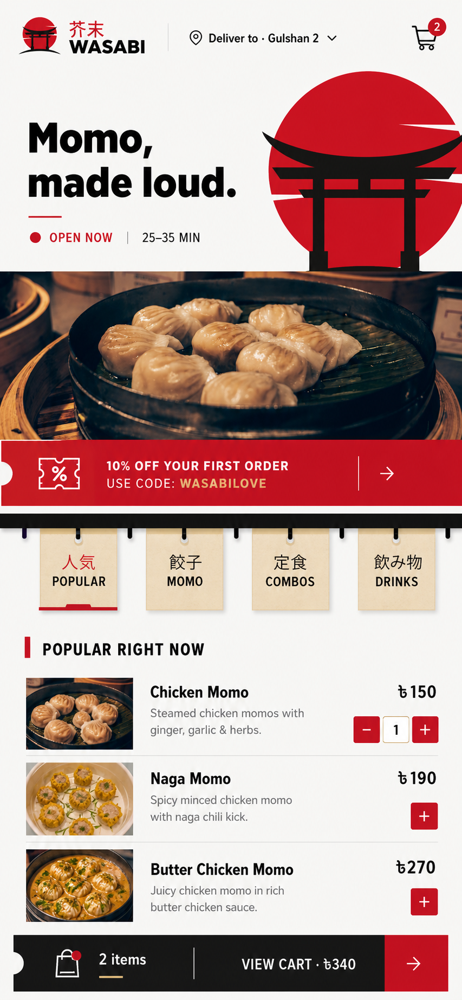
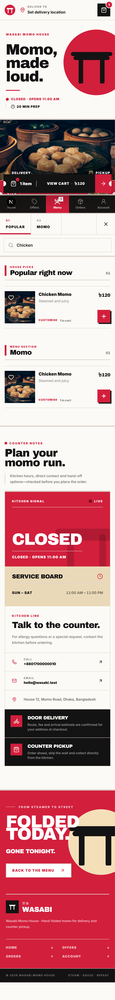
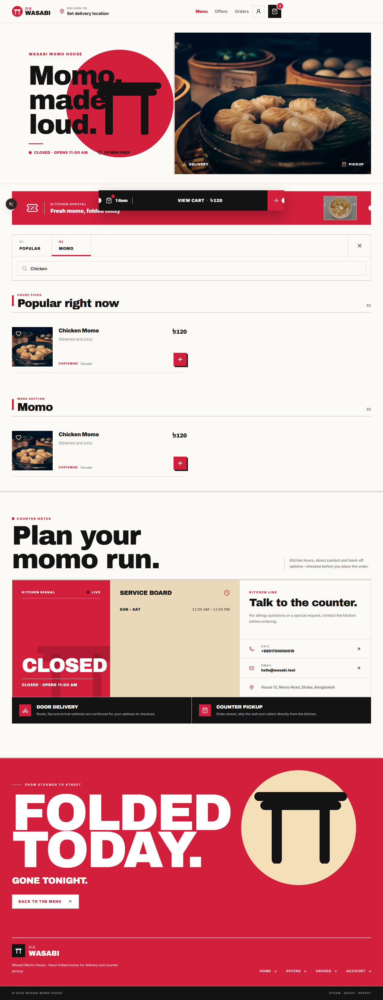

# WASABI Mobile Menu Concept V1

Date: 2026-08-14

Status: Implemented on the production customer-web `/menu` flow on 2026-08-14.

## Preview

## Implemented Result

| Mobile | Desktop |
| --- | --- |
|  |  |

The approved concept is now connected to the existing restaurant, menu, favourites, add-on, cart, authentication, saved-address, and ordering flows. This release changes the `/menu` experience only; the home, checkout, account, and orders pages remain candidates for a later visual-system rollout.

## Direction

The concept replaces the current generic rounded-card language with a mobile-first `Tokyo street counter` identity derived from the official WASABI logo.

- WASABI red sun and black torii geometry as the signature visual
- Rice-white background with charcoal structure and restrained bamboo-tan accents
- Mostly flat, edge-to-edge surfaces with small corner radii
- Ticket-rail category navigation instead of pill chips
- Compact food rows designed for one-handed mobile ordering
- Persistent cart action within thumb reach
- Bold geometric display typography instead of the current editorial serif treatment

## Intended Motion

- Shared-layout red marker when the active category changes
- Small spring response on add-to-cart and cart badge updates
- Product customisation drawer with a controlled mobile spring
- One-time restrained content reveal, not repeated floating-card animation
- Site-wide reduced-motion support

## Implemented Production Scope

1. Added scoped WASABI colours, `Archivo Black` display typography, ticket notches, and clipped-corner primitives without changing the rest of the website.
2. Rebuilt the menu header and restaurant hero around the WASABI red-sun and torii identity, using the saved/default delivery address when available.
3. Replaced category pills with a sticky ticket rail and a shared-layout active marker.
4. Rebuilt the menu browser as compact mobile rows and a two-column desktop layout, including search, featured items, favourites, quantity controls, and add-on entry points.
5. Rebuilt the customisation sheet and persistent cart dock with reduced-motion-aware Framer Motion transitions.
6. Added a dedicated flat information section and WASABI footer for the menu route.
7. Preserved the mobile bottom navigation and all existing API/cart/authentication behaviour.

## Main Changed Files

- `customer-web/app/menu/page.tsx`
- `customer-web/app/globals.css`
- `customer-web/app/layout.tsx`
- `customer-web/components/menu/menu-header.tsx`
- `customer-web/components/menu/restaurant-hero.tsx`
- `customer-web/components/menu/promo-slider.tsx`
- `customer-web/components/menu/menu-browser.tsx`
- `customer-web/components/menu/item-sheet.tsx`
- `customer-web/components/menu/info-block.tsx`
- `customer-web/components/menu/menu-footer.tsx`
- `customer-web/components/menu/menu-motion-provider.tsx`
- `customer-web/components/cart-bar.tsx`
- `customer-web/lib/api/queries/menu.ts`
- `customer-web/types/index.ts`
- `customer-web/e2e/specs/menu-premium.spec.ts`

## Verification Evidence

- Customer-web lint: passed.
- Unit tests: 4 of 4 passed.
- Next.js production build and TypeScript validation: passed; 20 routes generated.
- Live Playwright smoke tests: 2 of 2 passed against the running website and backend (Pixel 5 mobile viewport and desktop Chromium).
- Live WASABI API data: 4 categories and 10 menu items.
- Browser checks covered responsive overflow, search, product customisation, add-to-cart, cart dock behaviour, page errors, and unexpected HTTP failures.
- A stacking conflict between the customisation sheet and mobile navigation was discovered during browser testing and fixed by placing the sheet on the modal layer.

## Guardrails

- Keep all existing API, cart, authentication, ordering, and location flows intact.
- Do not introduce scroll hijacking, decorative 3D, excessive parallax, glassmorphism, or hover-only actions.
- Use the existing Framer Motion dependency first; add another package only when it solves a verified interaction gap.
