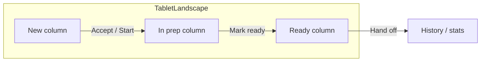
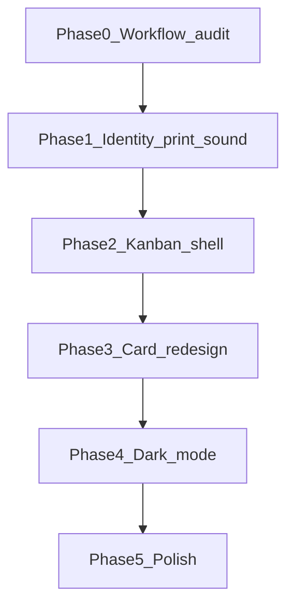

# Foodpanda-Style Kitchen KDS Launch Plan

Unified launch plan merging the kitchen UX improvements doc, the workflow-timers backend work, and Foodpanda-style KDS UX. Targets a production-ready wall/tablet kitchen experience: 3-column kanban, scannable cards, correct timers, and restaurant identity—while deferring station filtering and web-dashboard parity until post-pilot.

**Related docs:**

- Complements [`kitchen_workflow_timers_91fbef7a.plan.md`](kitchen_workflow_timers_91fbef7a.plan.md)
- Supersedes external `kitchen-app-ux-ui-improvements.md` (commandcode plans)

---

## Implementation checklist

- [ ] **Phase 0** — Verify workflow/history/timer behavior; fix gaps only
- [ ] **Phase 1** — Restaurant identity (no demo login, dynamic name, auth-scoped `restaurantId`)
- [ ] **Phase 1** — Print fail retry/skip banner; new-order sound + Settings toggle
- [ ] **Phase 2** — Responsive 2/3-column kanban, column headers, tablet full-screen Orders
- [ ] **Phase 3** — Foodpanda-style tile + expanded detail sheet
- [ ] **Phase 4** — Dark `ThemeData` + Settings toggle
- [ ] **Phase 5** — A11y, perf, settings grouping
- [ ] **Post-pilot** — Station filter (schema + backend + KDS chip)

---

## Target experience (Foodpanda KDS mental model)



| Foodpanda pattern | Current kitchen app gap |
|-------------------|-------------------------|
| 3 columns visible at once (New / Preparing / Ready) | [`MobileTabSelector`](apps/kitchen_app/lib/features/kds/presentation/widgets/mobile_tab_selector.dart) — one section at a time |
| Large order # + elapsed timer above fold | [`PremiumOrderCard`](apps/kitchen_app/lib/features/kds/presentation/widgets/premium_order_card.dart) — dense, many actions inline |
| Column headers with live counts | No column chrome; tabs only |
| Channel badge (delivery / pickup) | Partial or missing on cards |
| Full-screen orders on tablet; stats/menu secondary | [`KdsBoardScreen`](apps/kitchen_app/lib/features/kds/presentation/screens/kds_board_screen.dart) — bottom nav treats KDS like a staff app |
| Dark theme for kitchen lighting | [`main.dart`](apps/kitchen_app/lib/main.dart) light-only; [`KdsSidebar`](apps/kitchen_app/lib/features/kds/presentation/widgets/kds_sidebar.dart) unused |
| Correct restaurant name + auth-scoped toggles | Hardcoded `"Burger Palace"`, demo login, [`AppConfig.restaurantId`](apps/kitchen_app/lib/core/config/app_config.dart) |

**Realistic coverage:** Completing Phases 1–3 below delivers ~70% Foodpanda parity for pilot launch. Phases 4–5 polish toward 90%. Station filter and web KDS alignment stay post-pilot.

---

## Already implemented (do not re-build)

Audit before coding — much of workflow Phase 1 from [`kitchen_workflow_timers_91fbef7a.plan.md`](kitchen_workflow_timers_91fbef7a.plan.md) appears **done**:

| Area | Evidence |
|------|----------|
| Canonical workflow mapper | [`order_workflow.dart`](apps/kitchen_app/lib/features/kds/domain/order_workflow.dart) — `KitchenSection`, status mapping |
| Stage timers UI | [`order_stage_timer.dart`](apps/kitchen_app/lib/features/kds/presentation/widgets/order_stage_timer.dart) |
| Backend status service | [`order-status.service.ts`](backend/src/modules/orders/order-status.service.ts), `REJECTED` / `IGNORED_TEST` in Prisma |
| Kitchen history API | `GET /orders/kitchen/history` in [`orders.controller.ts`](backend/src/modules/orders/orders.controller.ts) |
| Stats uses history + mapper | [`daily_stats_view.dart`](apps/kitchen_app/lib/features/kds/presentation/screens/daily_stats_view.dart) |
| Timer policy cron | [`timer-policy.service.ts`](backend/src/modules/orders/timer-policy.service.ts) |

**Phase 0 task:** Run a short verification pass (manual + unit tests if present): history filter excludes active orders, reject → history not active, test-order toggle respected, timer anchors (`acceptedAt`, `readyAt`) match card display. Fix only gaps found — no greenfield rewrite.

**Phase 0 prerequisite:** Inspect the auth JWT payload and login response to confirm `restaurantId` is available. If it is missing, add a small backend `/auth/me` or `/restaurant` lookup endpoint before Phase 1.1.

---

## Phase 1 — Launch trust (P0, ~1–2 days)

Must ship before pilot; blocks wrong-restaurant ops and silent print failures.

### 1.1 Restaurant identity (UX plan §9)

- Remove demo / hardcoded credentials from login flow.
- Load restaurant name from `GET /restaurant/:id` (JWT `restaurantId`) in [`kds_header.dart`](apps/kitchen_app/lib/features/kds/presentation/widgets/kds_header.dart) — replace `"Burger Palace"`.
- Drive online toggle and all API calls from authenticated `restaurantId`, not `AppConfig.restaurantId`.
- Persist staff session via existing auth providers; show staff label in header if available.
- **Dev override:** Keep [`AppConfig.restaurantId`](apps/kitchen_app/lib/core/config/app_config.dart) as a debug fallback only (e.g. when running against a local backend), gated by `kDebugMode`. Do not use it for production identity.

### 1.2 Print failure feedback (UX plan §5 subset)

- When auto-print on accept fails (KOT path), show non-blocking banner with **Retry** and **Skip** — do not leave kitchen thinking ticket printed.
- Wire to existing print service / preferences in [`kitchen_preferences.dart`](apps/kitchen_app/lib/core/services/kitchen_preferences.dart).
- For non-Sunmi devices, banner should explain "Sunmi printer not detected" rather than silently failing.

### 1.3 Sound on new order (UX plan §7 subset)

- Optional toggle in Settings; default on for pilot.
- Wire toggle to the existing [`order_alert_service.dart`](apps/kitchen_app/lib/core/services/order_alert_service.dart) — do not rebuild audio playback.
- Play on websocket `order:created` / poll new order in [`active_orders_view.dart`](apps/kitchen_app/lib/features/kds/presentation/screens/active_orders_view.dart).

---

## Phase 2 — Foodpanda kanban layout (P0 for full launch, ~3–5 days)

Replace mobile-first tabs with responsive KDS shell.

### 2.1 Breakpoint strategy

| Width | Layout |
|-------|--------|
| `< 600` | Keep tab selector (single column) — phone fallback |
| `600–900` | 2 columns: New+Prep \| Ready |
| `>= 900` | 3 columns: New \| Preparing \| Ready |

Implement in new widget e.g. `kds_kanban_board.dart`; [`ActiveOrdersView`](apps/kitchen_app/lib/features/kds/presentation/screens/active_orders_view.dart) becomes orchestrator.

### 2.2 Column chrome

- Sticky header per column: title, count badge, optional avg wait (from existing timer data).
- Vertical scroll per column (`ListView.builder`), not one page scroll.
- Landscape: prefer `SystemChrome.setPreferredOrientations` when on Orders tab (tablet only).

### 2.3 Navigation restructure

- **Tablet:** Orders = full viewport; hamburger or side drawer for Stats / Menu / Settings (revive or replace dead `KdsSidebar`).
- **Phone:** Keep bottom nav but default to Orders; kanban degrades to tabs.
- Remove visual “consumer app” feel from primary KDS path — pink accent OK if kept on-brand ([`app_colors.dart`](apps/kitchen_app/lib/core/theme/app_colors.dart)).

### 2.4 Real-time refresh

- Ensure websocket reconnect + optimistic UI on accept/ready/reject still works per-column (existing providers in `active_orders_view.dart`).

---

## Phase 3 — Foodpanda card redesign (P0, ~2–3 days)

Simplify [`PremiumOrderCard`](apps/kitchen_app/lib/features/kds/presentation/widgets/premium_order_card.dart) for arm’s-length scanning.

### 3.1 Tile (collapsed) — always visible

- **Top row:** `#orderNumber` (28–32sp bold), channel pill (Delivery / Pickup), elapsed timer ([`OrderStageTimer`](apps/kitchen_app/lib/features/kds/presentation/widgets/order_stage_timer.dart)).
- **Second row:** Item count + first 2 line items truncated.
- **Third row:** Single primary CTA per section (Accept \| Start prep \| Mark ready) — color from section.
- SLA warning: amber/red border or top stripe when overdue (reuse timer policy thresholds if exposed client-side; else local thresholds aligned with backend).

### 3.2 Detail (expanded sheet / route)

- Full item list, modifiers, customer notes, reject reason, print button, rider ETA if present.
- Swipe or tap card to expand — keep tile clean like Foodpanda.

### 3.3 Empty states

- Per-column empty illustration + copy (“No new orders”) — not one global empty.

---

## Phase 4 — Dark mode + density (P1, ~2 days)

UX plan §3 — **must be built** (toggle does not exist today).

- Add `ThemeMode` to [`KitchenPreferences`](apps/kitchen_app/lib/core/services/kitchen_preferences.dart); Settings toggle.
- Define `ThemeData.dark` in kitchen theme using existing tokens — high contrast for kitchen.
- Card surfaces: `#1E1E1E` / border `#333`; preserve panda pink for primary actions only.
- Optional **Compact density** toggle (smaller padding) for high-volume stores.

---

## Phase 5 — Polish (P1–P2, post-kanban)

| Item | Source | Scope |
|------|--------|-------|
| Accessibility | UX §4 | Min 48dp targets, semantic labels on CTAs, timer announcements optional |
| Performance | UX §10 | `const` widgets, column list keys, debounce rebuilds on websocket burst |
| Settings cleanup | UX §10 | Group: display, sound, print, test orders, theme |
| A11y + haptics | UX §4 | Light haptic on accept/ready |

---

## Explicitly deferred (post-pilot)

- **Station / expo filtering (UX §6)** — requires `station` on `MenuItem` in Prisma + API filters; backend + app.
- **Web kitchen dashboard parity** — separate surface.
- **Server-pushed SLA websocket events** (`order:sla.*`) — optional; client timers sufficient for pilot if Phase 0 verifies anchors.
- **Full kanban on phones** — tabs remain fallback.

---

## Backend touch summary

| Phase | Backend work |
|-------|----------------|
| 0 | Verify only; patch bugs in `OrderStatusService` / history query if audit fails |
| 0 | If JWT lacks `restaurantId`, add `/auth/me` or restaurant lookup endpoint |
| 1 | None (existing restaurant + auth endpoints) |
| 2–3 | None |
| 4 | None |
| Deferred §6 | Schema + filter endpoints for station |

~**90% Flutter-only** for launch scope.

---

## Version control rhythm

Commit after each phase and push to GitHub. This keeps the backup current and lets you revert one phase without losing earlier work.

```bash
git add .
git commit -m "Phase X: brief description"
git push origin main
```

---

## Verification checklist (pilot sign-off)

1. Tablet landscape: 3 columns, counts update on accept/ready/reject.
2. Order # readable from 1.5m; timer ticks per stage.
3. Login shows correct restaurant name; online toggle affects correct store.
4. Print fail shows retry; sound on new order (toggle off works).
5. Reject lands in history; not in active column.
6. Dark mode readable under dim kitchen light.
7. Phone fallback: tabs still usable.

---

## Suggested implementation order



**Parallelizable after P1:** P4 dark theme tokens can start while P2 layout is in review; P3 depends on P2 column structure.

---

## Key files to modify

| File | Changes |
|------|---------|
| [`kds_board_screen.dart`](apps/kitchen_app/lib/features/kds/presentation/screens/kds_board_screen.dart) | Responsive shell, drawer vs bottom nav |
| [`active_orders_view.dart`](apps/kitchen_app/lib/features/kds/presentation/screens/active_orders_view.dart) | Kanban orchestration, websocket |
| New `kds_kanban_board.dart` | Column layout + headers |
| [`premium_order_card.dart`](apps/kitchen_app/lib/features/kds/presentation/widgets/premium_order_card.dart) | Tile + detail split |
| [`mobile_tab_selector.dart`](apps/kitchen_app/lib/features/kds/presentation/widgets/mobile_tab_selector.dart) | Narrow breakpoint only |
| [`kds_header.dart`](apps/kitchen_app/lib/features/kds/presentation/widgets/kds_header.dart) | Dynamic restaurant name |
| [`app_config.dart`](apps/kitchen_app/lib/core/config/app_config.dart) | Remove hardcoded restaurantId for prod paths |
| [`main.dart`](apps/kitchen_app/lib/main.dart) | ThemeMode |
| [`kitchen_preferences.dart`](apps/kitchen_app/lib/core/services/kitchen_preferences.dart) | Theme, sound, density prefs |
