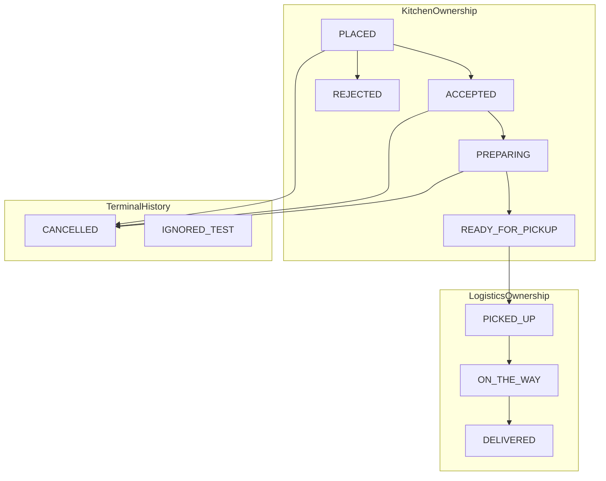
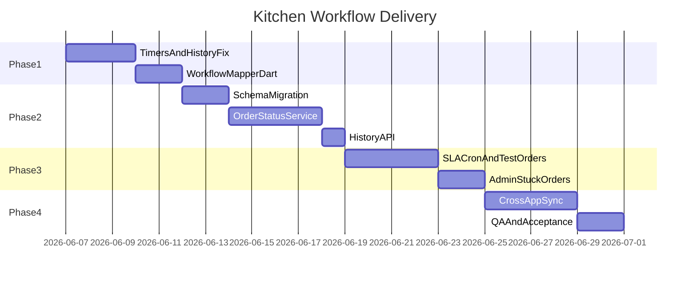

# Kitchen Workflow & Stage-Based Timers — Implementation Plan

## Goals (from senior PRD)

Fix the two production bugs today and deliver the full normalized workflow:

1. Replace the endless kitchen timer with **stage-based timers** tied to operational ownership.
2. Ensure **Recent Orders** shows **terminal history only** (never pending/preparing/ready/unaccepted).
3. Introduce **clear canonical semantics** (reject vs cancel vs test vs unmapped) without breaking 4 Flutter apps.
4. Add **backend guard rules**, **audit history**, **SLA timeouts**, **test-order filtering**, and **real-time sync** across kitchen/admin/customer/rider.

## Architecture decision (confirmed)

**Extend-and-map** (not full enum rename):

- Keep existing Prisma `OrderStatus` values: `PLACED`, `ACCEPTED`, `PREPARING`, `READY_FOR_PICKUP`, `PICKED_UP`, `ON_THE_WAY`, `DELIVERED`, `CANCELLED`.
- **Add** `REJECTED` and `IGNORED_TEST` to the enum.
- Add metadata fields to distinguish cancel sources (`cancelledBy`, `isTest`, etc.).
- Introduce a **canonical mapping layer** in backend + kitchen app that maps storage status → senior's canonical names, UI sections, timer types, and allowed actions.
- **`rider_assigned`** remains on [`RiderAssignment`](backend/prisma/schema.prisma) (with new `riderAssignedAt` on `Order`), **not** as an order status—matching the PRD note that logistics runs parallel to kitchen states.



---

## Canonical mapping spec (single source of truth)

Create shared mapping definitions:

| Storage status | Canonical name (senior PRD) | Kitchen section | Timer type | Timer anchor field | UI label |
|---|---|---|---|---|---|
| `PLACED` | `pending_kitchen_acceptance` | NewOrders | acceptance | `placedAt` / `createdAt` | Accept within |
| `ACCEPTED` | `accepted_by_kitchen` | Preparing | preparation | `acceptedAt` | Preparing for |
| `PREPARING` | `preparing` | Preparing | preparation | `prepStartedAt` ?? `acceptedAt` | Preparing for |
| `READY_FOR_PICKUP` | `ready_for_pickup` | Ready | pickup_wait | `readyAt` | Ready since |
| `PICKED_UP` / `ON_THE_WAY` | logistics | optional kitchen visibility only | delivery | `pickedUpAt` | Delivering for |
| `DELIVERED` | `delivered` | History | none | — | Completed |
| `REJECTED` | `rejected_by_kitchen` | History | none | `rejectedAt` | Rejected |
| `CANCELLED` + `cancelledBy=CUSTOMER` | `cancelled_by_customer` | History | none | `cancelledAt` | Cancelled |
| `CANCELLED` + `cancelledBy=SYSTEM` | `cancelled_by_system` | History | none | `cancelledAt` | Cancelled |
| `IGNORED_TEST` | `ignored_test_order` | Ignored bucket | none | — | Test |

**Recent Orders allowed statuses:** `DELIVERED`, `REJECTED`, `CANCELLED` (with reason metadata), optionally hidden `IGNORED_TEST` unless admin toggle is on.

**Recent Orders excluded:** `PLACED`, `ACCEPTED`, `PREPARING`, `READY_FOR_PICKUP`, `PICKED_UP`, `ON_THE_WAY`, unmapped/sync-error states.

---

## Phase 1 — Core bug fixes + mapping foundation (ship first)

### 1.1 Kitchen stage-based timers

**Files:**
- [`apps/kitchen_app/lib/features/kds/presentation/widgets/order_timer.dart`](apps/kitchen_app/lib/features/kds/presentation/widgets/order_timer.dart) — refactor `OrderPrepTimer` → `OrderStageTimer` accepting `TimerType`, `startTime`, `labelPrefix`, SLA thresholds.
- [`apps/kitchen_app/lib/features/kds/presentation/widgets/premium_order_card.dart`](apps/kitchen_app/lib/features/kds/presentation/widgets/premium_order_card.dart) — stop hardcoding `createdAt`; derive timer from order status via mapper.
- **New:** `apps/kitchen_app/lib/features/kds/domain/order_workflow.dart` — Dart enums `KitchenSection`, `TimerType`, `CanonicalOrderStatus`; pure functions: `sectionForStatus`, `timerForOrder`, `allowedActions`.

**Behavior:**
- Acceptance timer runs only for `PLACED`; stops on accept/reject.
- Preparation timer runs for `ACCEPTED`/`PREPARING`; stops on mark ready.
- Pickup wait timer runs for `READY_FOR_PICKUP`; stops at `pickedUpAt` (display frozen/stopped after pickup even if card briefly visible).
- Rider assignment does **not** affect kitchen timer anchor.

### 1.2 Fix Recent Orders pollution

**Files:**
- [`apps/kitchen_app/lib/features/kds/presentation/screens/daily_stats_view.dart`](apps/kitchen_app/lib/features/kds/presentation/screens/daily_stats_view.dart)

**Changes:**
- Remove `READY_FOR_PICKUP` and `PICKED_UP` from "completed" filter (current bug at lines 16–19).
- Include only terminal: `DELIVERED`, `REJECTED`, `CANCELLED` (and `IGNORED_TEST` only when toggle enabled—Phase 3).
- Filter "today" by `deliveredAt` / `rejectedAt` / `cancelledAt`, not `createdAt`.
- Show human-readable canonical labels, not raw enum strings.

### 1.3 Kitchen section filtering via mapper

**Files:**
- [`apps/kitchen_app/lib/features/kds/presentation/screens/active_orders_view.dart`](apps/kitchen_app/lib/features/kds/presentation/screens/active_orders_view.dart)
- [`apps/kitchen_app/lib/features/kds/presentation/providers/kds_provider.dart`](apps/kitchen_app/lib/features/kds/presentation/providers/kds_provider.dart)

**Changes:**
- Replace scattered string checks with mapper-driven selectors.
- **New Orders:** `PLACED` only (remove `ACCEPTED` from New tab per senior PRD).
- **Preparing:** `ACCEPTED`, `PREPARING`.
- **Ready:** `READY_FOR_PICKUP`.
- **Accept flow:** one tap → backend accept moves to `PREPARING` directly (see Phase 2 backend change); UI button label stays "Accept Order".

### 1.4 Riverpod derived selectors

Add to `kds_provider.dart` or new `kitchen_orders_selectors.dart`:

```dart
final newOrdersProvider = Provider((ref) =>
  ref.watch(kdsProvider).orders.where((o) => sectionForStatus(o) == KitchenSection.newOrders));
```

Same pattern for preparing, ready, and history providers.

---

## Phase 2 — Data model & backend workflow services

### 2.1 Prisma schema extensions

**File:** [`backend/prisma/schema.prisma`](backend/prisma/schema.prisma)

**Add to `OrderStatus` enum:**
- `REJECTED`
- `IGNORED_TEST`

**Add to `Order` model:**
```prisma
enum CancelledBy { CUSTOMER SYSTEM KITCHEN }

isTest              Boolean      @default(false)
ignoreInReporting   Boolean      @default(false)
cancelledBy         CancelledBy?
externalStatus      String?
normalizedStatus    String?      // cached canonical name for analytics

prepStartedAt       DateTime?
rejectedAt          DateTime?
riderAssignedAt     DateTime?

// SLA defaults can live on RestaurantSettings; optional per-order overrides:
slaAcceptSeconds    Int?
slaPrepSeconds      Int?
slaPickupWaitSeconds Int?
```

**Extend `OrderStatusHistory`:**
- Add `previousStatus OrderStatus?` for full audit trail.

**Extend `RestaurantSettings`:**
- `slaAcceptSeconds` (default 300), `slaPrepSeconds` (default 1200), `slaPickupWaitSeconds` (default 900), `showTestOrdersInKitchen` (default false).

Run Prisma migration + backfill script for existing rows.

### 2.2 OrderStatusService (extract from monolith)

**New files:**
- `backend/src/modules/orders/order-status.service.ts`
- `backend/src/modules/orders/order-workflow.mapper.ts`

**Responsibilities:**
- Single entry point for all status transitions (`transitionOrder(user, orderId, targetStatus, meta)`).
- Enforce `VALID_TRANSITIONS` with **tightened rules** per senior PRD:
  - Kitchen-only: `PLACED→ACCEPTED|REJECTED`, `PREPARING→READY_FOR_PICKUP`.
  - Rider-only: `READY_FOR_PICKUP→PICKED_UP`, `PICKED_UP→ON_THE_WAY`.
  - Remove rider/staff shortcuts `ACCEPTED→PICKED_UP` and `PREPARING→PICKED_UP` unless staff role explicitly overrides (document decision).
- Set timestamps atomically: `acceptedAt`, `prepStartedAt`, `readyAt`, `rejectedAt`, `pickedUpAt`, `deliveredAt`, `cancelledAt`, `riderAssignedAt`.
- Write `OrderStatusHistory` with `previousStatus`, `changedBy`, `note`.
- Idempotent transitions: if target status equals current, return existing order (no duplicate history).
- Emit realtime events via existing [`realtime.service.ts`](backend/src/gateways/realtime.service.ts).

**Refactor:** [`backend/src/modules/orders/orders.service.ts`](backend/src/modules/orders/orders.service.ts) delegates accept/reject/update/cancel to `OrderStatusService`.

### 2.3 Accept / reject behavior updates

- `acceptOrder`: `PLACED → PREPARING` in one step; set `acceptedAt` + `prepStartedAt`; trigger print + rider auto-assign (existing behavior).
- `rejectOrder`: `PLACED → REJECTED` (not `CANCELLED`); set `rejectedAt`.
- `cancelOrder`: set `cancelledBy` based on actor (`CUSTOMER`, `SYSTEM`, `KITCHEN`).
- `placeOrder`: support `isTest` flag on DTO for test order creation.

### 2.4 Kitchen history API

**New endpoint:** `GET /orders/kitchen/history?date=YYYY-MM-DD&includeTest=false`

**File:** [`backend/src/modules/orders/orders.controller.ts`](backend/src/modules/orders/orders.controller.ts)

Server-side filter for terminal statuses only; excludes `isTest=true` unless `includeTest=true`. Replace client-side `/orders?limit=200` hack in [`daily_stats_view.dart`](apps/kitchen_app/lib/features/kds/presentation/screens/daily_stats_view.dart).

### 2.5 TimerPolicyService

**New file:** `backend/src/modules/orders/timer-policy.service.ts`

- Compute elapsed seconds per stage from timestamps (no persisted `current_timer_type`).
- Evaluate SLA breach thresholds from restaurant settings.
- Emit WebSocket events: `order:sla.warning`, `order:sla.breached` to `restaurant:{id}` room.
- Used by kitchen UI for yellow/red urgency (replacing hardcoded 10/20 min logic in [`order_timer.dart`](apps/kitchen_app/lib/features/kds/presentation/widgets/order_timer.dart)).

---

## Phase 3 — Edge cases, timeouts, test orders, admin visibility

### 3.1 Pending acceptance timeout

**New cron** in `timer-policy.service.ts` or dedicated `order-sla.cron.ts`:

- Scan `PLACED` orders older than `slaAcceptSeconds`.
- Actions (configurable per restaurant):
  1. Emit manager alert (`order:sla.breached`).
  2. Optional auto-reject → `REJECTED` with note "Auto-rejected: acceptance timeout".
  3. Optional auto-cancel → `CANCELLED` + `cancelledBy=SYSTEM`.

Log all auto-actions in `OrderStatusHistory` with `changedBy=system`.

### 3.2 Ready-for-pickup wait timeout

- Scan `READY_FOR_PICKUP` where `now - readyAt > slaPickupWaitSeconds`.
- Alert operations + re-trigger rider dispatch if unassigned/expired assignment.
- Mark metadata flag `delayedPickup=true` (optional JSON on order or audit note)—do not move to history.

### 3.3 Sync race: rider assigned before kitchen marks ready

- Kitchen UI ignores assignment until status is `READY_FOR_PICKUP` for handoff CTAs.
- Backend enforces: rider `PICKED_UP` transition only allowed from `READY_FOR_PICKUP` (Phase 2 guard tightening).
- If assignment exists while `PREPARING`, show read-only "Rider pending" badge on card—does not change timer.

### 3.4 Double-tap / idempotency

- Backend: duplicate accept/reject/ready returns 200 with same order (no duplicate history rows).
- Frontend: disable action buttons while request in flight in [`premium_order_card.dart`](apps/kitchen_app/lib/features/kds/presentation/widgets/premium_order_card.dart).

### 3.5 Test order handling

- `POST /orders` accepts optional `isTest: true` (staff/admin only or env-guarded).
- Test orders: default status flow OR direct `IGNORED_TEST` for bulk cleanup scripts.
- Excluded from [`reports.service.ts`](backend/src/modules/reports/reports.service.ts) when `ignoreInReporting=true`.
- Kitchen history excludes unless `RestaurantSettings.showTestOrdersInKitchen=true`.

### 3.6 Unmapped / sync-error statuses

**New file:** `backend/src/modules/orders/status-mapping.service.ts`

- Map inbound external statuses → internal enum.
- Unknown status → store in `externalStatus`, set `normalizedStatus='sync_error'`, **exclude from kitchen active queues**.
- Admin-only view in [`admin_app`](apps/admin_app/lib/features/orders/presentation/screens/orders_management_screen.dart) for sync-error bucket.

### 3.7 Admin stuck-order dashboard

**Files:**
- [`backend/src/modules/admin/admin.service.ts`](backend/src/modules/admin/admin.service.ts) — add `getStuckOrders()` query.
- [`apps/admin_app`](apps/admin_app/lib/features/orders/presentation/screens/orders_management_screen.dart) — stuck orders panel: pending acceptance SLA breach, ready wait breach, unmapped status.

---

## Phase 4 — Cross-app consistency & realtime

### 4.1 Customer app

**Files:** [`order_status_timeline.dart`](apps/customer_app/lib/features/orders/presentation/widgets/order_status_timeline.dart), [`enhanced_eta_card.dart`](apps/customer_app/lib/features/orders/presentation/widgets/enhanced_eta_card.dart), [`order_tracking_screen.dart`](apps/customer_app/lib/features/orders/presentation/screens/order_tracking_screen.dart)

- Add `REJECTED` and `IGNORED_TEST` display handling.
- Map `REJECTED` in timeline as terminal failure state.
- Keep existing `PICKED_UP` / `ON_THE_WAY` / `DELIVERED` flow.

### 4.2 Rider app

**Files:** [`delivery_state_model.dart`](apps/rider_app/lib/features/orders/data/delivery_state_model.dart), [`active_order_restore.dart`](apps/rider_app/lib/features/orders/presentation/providers/active_order_restore.dart)

- Ensure pickup only offered when order is `READY_FOR_PICKUP`.
- Update tests in `apps/rider_app/test/features/orders/`.

### 4.3 Admin app

**Files:** [`orders_management_screen.dart`](apps/admin_app/lib/features/orders/presentation/screens/orders_management_screen.dart), [`status_mappings.dart`](apps/admin_app/lib/core/widgets/status_mappings.dart)

- Sync `_nextStatuses` with backend `OrderStatusService` rules.
- Add `REJECTED`, `IGNORED_TEST` filters and badges.
- Add "Show test data" toggle wired to settings API.

### 4.4 Realtime requirements (FR4)

On every kitchen accept/reject/ready transition, verify events propagate:

- Kitchen: existing `order:status.changed` + new `order:sla.*` in [`kds_provider.dart`](apps/kitchen_app/lib/features/kds/presentation/providers/kds_provider.dart)
- Admin: live orders provider refresh
- Rider: assignment + status streams
- Customer: tracking provider refresh

### 4.5 Reports accuracy

**File:** [`backend/src/modules/reports/reports.service.ts`](backend/src/modules/reports/reports.service.ts)

- Exclude `REJECTED`, `IGNORED_TEST`, `isTest` from revenue metrics.
- Prep analytics use `prepStartedAt → readyAt` (fallback `acceptedAt → readyAt` for legacy rows).

---

## Phase 5 — Verification & acceptance criteria

Manual + automated QA against senior acceptance criteria:

| # | Criterion | Verification |
|---|---|---|
| 1 | New order only in New Orders until accepted | `PLACED` only in New tab; disappears after accept |
| 2 | Accept stops acceptance timer, starts prep timer | UI shows label change + anchor switches to `acceptedAt`/`prepStartedAt` |
| 3 | Mark ready stops prep, starts pickup wait | Anchor switches to `readyAt` |
| 4 | Rider assignment does not extend kitchen timer | Assign rider while preparing; timer unchanged |
| 5 | Recent Orders = terminal only | No `PLACED`/`PREPARING`/`READY` after bulk test order creation |
| 6 | Test orders filtered | `isTest=true` absent from stats/history by default |
| 7 | Audit + guards | Every transition in `OrderStatusHistory` with `previousStatus`; invalid transitions return 400 |

**Test scripts:** extend [`backend/scripts/smoke-test.mjs`](backend/scripts/smoke-test.mjs) with kitchen workflow scenario.

---

## File change summary

| Area | Primary files |
|---|---|
| Kitchen UI | `order_timer.dart`, `premium_order_card.dart`, `active_orders_view.dart`, `daily_stats_view.dart`, `kds_provider.dart`, new `order_workflow.dart` |
| Backend core | `schema.prisma`, `orders.service.ts`, new `order-status.service.ts`, `order-workflow.mapper.ts`, `timer-policy.service.ts`, `status-mapping.service.ts`, `orders.controller.ts` |
| Admin | `admin.service.ts`, `orders_management_screen.dart`, restaurant settings DTO |
| Customer/Rider | timeline, tracking, delivery state model (targeted updates) |
| Reports | `reports.service.ts` |

---

## Delivery sequence (recommended)



**Phase 1 is shippable alone** and resolves the bugs your senior flagged. Phases 2–4 complete the full PRD (canonical semantics, guards, timeouts, test orders, admin visibility, cross-app sync).

---

## Out of scope (explicitly deferred)

- Full snake_case enum rename in database/API (avoided by extend-and-map strategy).
- `restaurant-merchant-dashboard` integration (still mock data; mapping documented for future wiring).
- Third-party webhook ingestion (StatusMappingService scaffold only until integrations exist).
